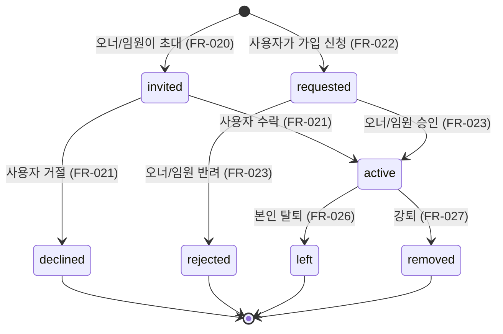
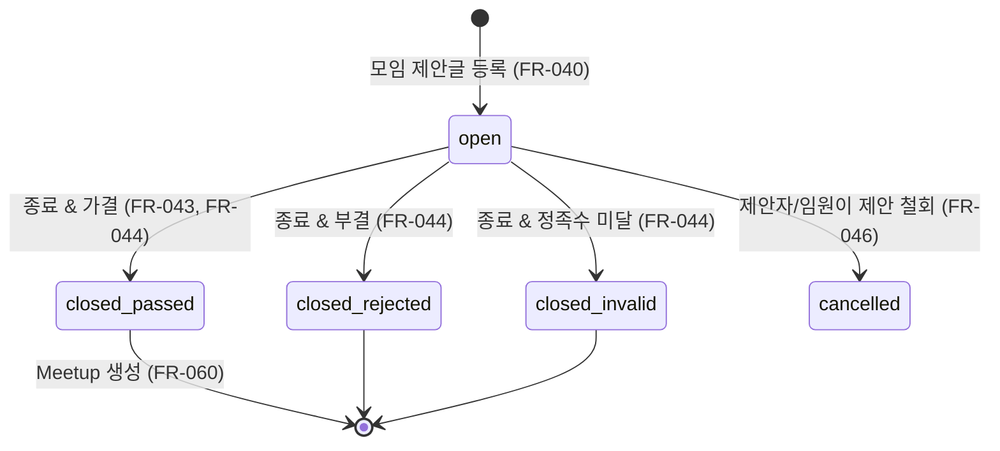
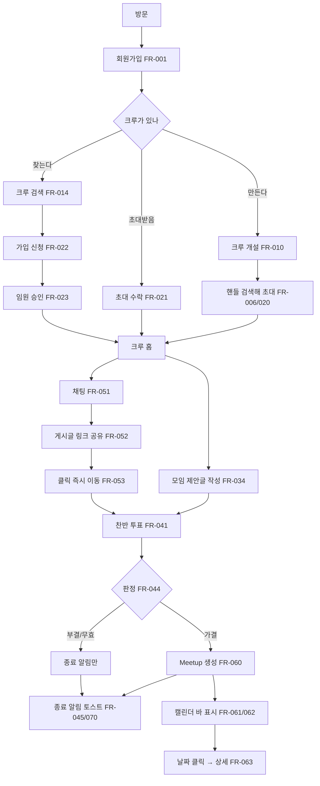
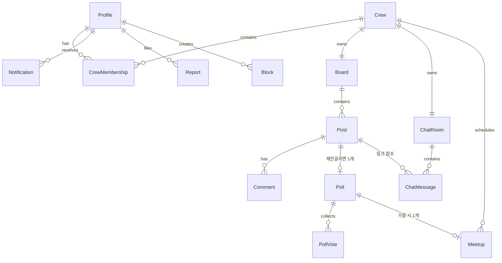

# 크루 모임 웹 서비스 — 요구사항 정의

- **문서 상태**: 초안 (v0.1, 2026-07-23) — **2026-07-23 고객 검토에서 미결 15건이 모두 D-001~D-014로 확정됨**(아래 5.5절). 열린 I-\* 없음.
- **작성**: requirements-analysis-expert
- **출처**: 고객 원문 요구사항 13개 항목 (이하 "원문 №n")
- **절 번호 규약**: 이 문서가 1~5절을 담당한다. **6절(우선순위·리스크·결정)은 [`../prioritization-and-risks.md`](../prioritization-and-risks.md)** 이 단일 소스다.

## 이 문서의 경계 (반드시 지킬 것)

| 종류 | 단일 소스 | 이 문서에서는 |
| --- | --- | --- |
| 우선순위(MoSCoW) | `prioritization-and-risks.md` 6.1 | 참조만 |
| 리스크 R-\* | `prioritization-and-risks.md` 6.2 | 번호로 참조만 |
| 확정 결정 D-\* | `prioritization-and-risks.md` 6.3 | 번호로 참조만 |
| 미결 이슈 I-\* | `ISSUES.md` | 번호로 참조만 |
| 요구사항 FR-\*/NFR-\* | **이 문서** | 정의 |

표기 규약:

- **(원문 №n)** — 고객 원문에 근거가 있는 요구사항.
- **(보완)** — 원문에 없으나 제품이 성립하려면 필요해 분석 과정에서 추가한 요구사항. 고객 확인 대상이다.
- **(해석)** — 원문이 모호해 해석을 적용한 부분. 해석 근거를 함께 적었고, 확인이 필요한 것은 I-\* 로 등재했다. 고객이 확인해 확정된 것은 **D-\*** 로 승격됐다.

---

## 1. 개요·목적·범위

### 1.1 제품 한 줄 정의

**동호회·소모임(크루)을 만들고, 크루 안에서 게시글로 모임 일정을 제안하고, 찬반 투표로 확정한 뒤, 확정된 일정을 캘린더에서 한눈에 보는 웹 서비스.**

### 1.2 해결하려는 문제 (해석)

원문에는 배경 설명이 없다. 기능 구성(제안 → 투표 → 캘린더 등록 → 알림)에서 역산한 문제 정의이며, 고객 확인 대상이었고 2026-07-23 검토에서 확인됐다(**D-001**).

| # | 문제 | 이 제품의 대응 |
| --- | --- | --- |
| P1 | 모임 일정이 카카오톡 등 채팅에 묻혀 누가 찬성했는지 남지 않는다 | 게시글 + 기록되는 찬반 투표 (원문 №6) |
| P2 | 일정이 확정돼도 각자 개인 캘린더에 옮겨 적어야 한다 | 가결 시 캘린더 자동 등록 (원문 №9) |
| P3 | 여러 크루에 속하면 일정이 흩어져 겹침을 못 본다 | 크루 색 구분된 통합 캘린더 (원문 №9·№10) |
| P4 | 투표가 끝난 걸 아무도 모른다 | 종료 알림 (원문 №8) |
| P5 | 크루를 새로 찾을 방법이 없다 | 크루 검색·가입 신청 (원문 №11·№12) |

### 1.3 성공 기준 (보완 — 측정 가능한 형태로 제안, 고객 합의 필요)

| ID | 지표 | 목표 | 측정 방법 |
| --- | --- | --- | --- |
| KPI-1 | 생성된 크루 중 30일 내 Meetup을 1건 이상 가결한 비율 | ≥ 40% | 크루별 가결 Meetup 수 집계 |
| KPI-2 | 모임 제안 게시글의 투표 참여율(크루 활성 인원 대비) | ≥ 60% | 투표 수 / 투표 대상자 수 |
| KPI-3 | 투표 종료 알림 클릭률 | ≥ 25% | 알림 노출 대비 클릭 |
| KPI-4 | 가입 신청 후 72시간 내 승인·반려 처리율 | ≥ 80% | 신청 상태 전이 시각 |
| KPI-5 | 크루 검색 → 가입 신청 전환율 | ≥ 10% | 검색 세션 대비 신청 |
| KPI-6 | `/sample` 쇼케이스의 컴포넌트 등록 커버율 | 100% | 정의된 컴포넌트 목록 대비 등록 수 |

> KPI-6은 `CLAUDE.md`의 Mock First 개발 원칙("신규 컴포넌트는 `/sample`에 등록한다")을 측정 가능한 형태로 옮긴 개발 프로세스 지표다. 나머지는 제품 지표이며 실데이터 연동(v0.2) 이후에야 측정 가능하다.

### 1.4 범위

#### In-scope (이번 릴리스 = v0.1 Mock UI → v0.2 실데이터)

1. 회원가입·로그인·프로필 (원문 №1, 보완)
2. 크루 개설·수정·해산 (원문 №2, 보완)
3. 크루 멤버십: 초대, 가입 신청, 승인·반려, 임원 임명, 탈퇴·강퇴 (원문 №3·№4·№12, 보완)
4. 크루별 커뮤니티 게시판(게시글·댓글 CRUD) (원문 №6, 보완)
5. 모임 제안 게시글의 찬반 투표와 결과 판정 (원문 №6·№9)
6. 크루별 채팅방과 게시글 링크 공유 (원문 №5·№7)
7. 캘린더: 가결 Meetup 자동 등록, 크루 색 구분 바, 날짜 클릭 상세 (원문 №9·№10)
8. **인앱 알림(토스트 + 알림 센터)** (원문 №8의 toast 부분)
9. 크루 검색 (원문 №11)
10. 신고·차단·최소 관리자 기능 (보완 — 사용자 생성 콘텐츠 서비스의 운영 하한선)
11. Next.js + Supabase + Vercel 스택 (원문 №13)

#### Out-of-scope (이번 릴리스 밖 — 의도적으로 미룸)

| 항목 | 근거 |
| --- | --- |
| **Web Push / 모바일 Push 발송** | 원문 №13이 "push도 추후 개발 예정"이라 명시. 단 **알림 도메인 모델은 이번에 설계**한다(9절). 원문 №8이 push를 언급해 R-014로 등재했으나 **2026-07-23 D-004로 확정, R-014 해소**. |
| **네이티브 앱** | 원문 №13 "추후에 native app으로 변경 예정". 이번 릴리스는 전환 대비 **아키텍처 제약**(5.4절)만 반영. |
| 크루 간 통합 채팅 / DM | 원문 №5는 "각각의 모임에" 채팅방이 존재한다고만 함. 1:1 DM 요구 없음. |
| 결제·회비 관리 | 원문에 없음. |
| 외부 캘린더(Google/Apple) 동기화 | 원문에 없음. 데이터 모델은 iCal 매핑 가능하게 두되 기능은 미포함. |
| 파일·이미지 업로드(게시글 첨부, 채팅 파일 전송) | 원문에 없음. 아바타 이미지만 예외로 검토(AS-12). |
| 위치 기반 크루 추천 | 원문에 없음. |
| 크루 공개 프로필 SEO 페이지 | 원문에 없음. |

#### 2026-07-23 검토에서 범위가 **확정**된 것

- 크루 개설은 **관리자 승인 없이 즉시 생성**한다 → **D-008**
- Meetup에 **시각·장소·정원**을 둔다(선택 입력). 정원 지정 시 **선착순 참석 신청**이 따라온다 → **D-013**, FR-066~FR-068
- 공개 크루는 **비로그인 방문자도** 검색·소개를 볼 수 있다 → **D-007**
- v0.1은 **한국어 단독**이며 로케일 경로 세그먼트를 두지 않는다 → **D-011**

### 1.5 이해관계자

| 구분 | 역할 | 관심사 |
| --- | --- | --- |
| 고객사 | 요구사항 승인, 우선순위 결정 | 범위·일정 |
| 최종 사용자 — 크루 오너 | 크루 운영 | 멤버 관리 비용, 일정 확정 속도 |
| 최종 사용자 — 크루원 | 참여 | 투표 편의, 일정 파악 |
| 개발팀 | 구현 | 스택 제약, Mock First 준수 |
| 운영자 | 신고 처리 | 남용 대응 수단 |

---

## 2. 용어 정의와 도메인 구조

### 2.1 원문의 핵심 모호성: "모임"이 두 가지를 가리킨다

원문에서 "모임"이라는 단어는 **서로 다른 두 개념**에 쓰였다. 이걸 분리하지 않으면 데이터 모델과 화면이 전부 어긋난다.

| 원문 № | 문장 | 여기서 "모임"은 | 판단 근거 |
| --- | --- | --- | --- |
| №2 | "모임장 등록" | **지속적 그룹** | 사람에게 붙는 직책이므로 일회성 이벤트에 붙을 수 없다 |
| №3 | "모임장은 모임크루를 등록할 수 있다" | **지속적 그룹** | "크루"라는 단어가 명시적으로 등장하고, 구성원을 등록하는 대상이다 |
| №5 | "각각의 모임에는 커뮤니티, 채팅방이 존재한다" | **지속적 그룹** | 커뮤니티·채팅방은 지속 공간이다. 일회성 이벤트마다 채팅방을 만든다는 해석은 №7(게시글 링크 공유)과 충돌 |
| №6 | "**커뮤니티에 모임에 대해 등록**하고 찬성/반대 투표" | **일회성 이벤트** | 커뮤니티(그룹의 하위 공간) *안에* 등록되는 대상이므로 그룹일 수 없다 |
| №9 | "**모임이** 투표의 찬성수가 많을 경우 캘린더에 등록" | **일회성 이벤트** | 캘린더의 특정 날짜에 얹히는 것은 날짜를 가진 이벤트다 |
| №11 | "회원들은 **모임을** 검색할 수 있다" | **지속적 그룹** | №12에서 검색 결과에 "가입 신청"을 넣으므로 가입 대상 = 그룹 |
| №12 | "원하는 **모임을** 가입 신청" | **지속적 그룹** | 위와 동일 |

**결론**: 두 개념을 별도 엔티티로 분리한다.

- **Crew (크루)** — 지속적인 그룹. 원문 №2·3·5·11·12의 "모임".
- **Meetup (모임 일정)** — Crew 안에서 제안되고 투표로 확정되는 **날짜를 가진 1회성 이벤트**. 원문 №6·9·10의 "모임".

이 분리는 원문 재해석이었으나 **2026-07-23 고객 검토에서 확정됐다 → D-001**(I-001 종결). 관련 리스크 **R-010**.

### 2.2 용어집

| 용어 | 영문/식별자 | 정의 | 원문 대응 |
| --- | --- | --- | --- |
| 크루 | `Crew` | 지속적으로 유지되는 동호회/소모임 단위. 커뮤니티 게시판 1개와 채팅방 1개를 반드시 가진다. | "모임", "모임크루" |
| 크루 오너 | `CrewOwner` | 크루를 개설한 사람. 크루당 **정확히 1명**. | "모임장" |
| 임원 | `CrewStaff` | 오너가 지명한 운영 권한 보유 크루원. | "모임 임원", №4의 "모임장으로 지명" (해석) |
| 크루원 | `CrewMember` | 크루에 소속된 일반 구성원. 오너·임원도 크루원의 부분집합이다. | "회원", "크루" |
| 일반회원 | `Member` | 가입했으나 특정 크루에는 속하지 않은(또는 그 크루 밖의) 사용자. | "일반회원" |
| 커뮤니티 | `Board` | 크루에 종속된 게시판. 크루당 1개. | "커뮤니티" |
| 게시글 | `Post` | 커뮤니티의 글. **일반글**과 **모임 제안글** 두 유형. | "게시글", "모임에 대해 등록" |
| 모임 제안 | `MeetupProposal` | 날짜 후보를 담은 게시글 유형. 생성 시 찬반 투표가 함께 만들어진다. | №6 |
| 투표 | `Poll` | 모임 제안에 붙는 찬성/반대 투표. 제안 1건당 1개. | "찬성/반대 투표" |
| Meetup | `Meetup` | 투표 **가결**로 확정된 일정. 캘린더에 표시되는 실체. | №9의 "모임" |
| 캘린더 바 | `MeetupBar` | 캘린더 날짜 셀에 표시되는 얇은 가로 막대 1개 = Meetup 1건. | "얇은 줄" |
| 채팅방 | `ChatRoom` | 크루에 종속된 실시간 대화 공간. 크루당 1개. | "채팅방" |
| 가입 신청 | `JoinRequest` | **사용자 → 크루** 방향. 크루 측 승인 필요. | №12 |
| 초대 | `Invitation` | **크루 → 사용자** 방향. 사용자 측 수락 필요. | №3 |
| 핸들 | `handle` | 사용자를 검색·멘션할 때 쓰는 공개 문자열 식별자. 이메일과 분리한다. | №3의 "가입한 ID" (해석) |

### 2.3 "가입한 ID"를 핸들로 해석하는 근거 (원문 №3)

원문은 "회원 가입한 ID로 검색 후 신청"이라 쓰나, 회원가입 식별자를 그대로 검색 키로 쓰면 문제가 생긴다.

- 이메일이 로그인 ID라면 → **이메일 열거(enumeration) 공격**과 개인정보 노출.
- 내부 UUID라면 → 사람이 검색어로 입력할 수 없다.

따라서 **로그인 식별자와 분리된 공개 핸들**을 도입하고, 검색은 핸들 **정확 일치**만 허용한다(부분 일치는 열거 공격 표면). 상세 규칙은 3.6절. **2026-07-23 확정 → D-005**(I-007 종결). 리스크는 **R-012**.

### 2.4 상태 전이

**Crew 멤버십 상태**

**Poll(투표) 상태**

---

## 3. 사용자 역할·권한과 도메인 규칙

### 3.1 역할 정의

| 역할 | 식별자 | 범위 | 설명 |
| --- | --- | --- | --- |
| 비회원 | `guest` | 전역 | 미인증 방문자 |
| 일반회원 | `member` | 전역 | 인증된 사용자. 특정 크루에 대해 비소속 |
| 크루원 | `crew_member` | 크루별 | 해당 크루 소속 (`status = active`) |
| 임원 | `crew_staff` | 크루별 | 크루원 + 운영 권한 |
| 크루 오너 | `crew_owner` | 크루별 | 크루당 1명. 임원 권한 전부 + 크루 존폐 권한 |
| 시스템 관리자 | `system_admin` | 전역 | 신고 처리·계정 제재 (보완) |

**역할은 크루 단위로 부여된다.** 한 사용자가 크루 A의 오너이면서 크루 B의 일반 크루원일 수 있다.

### 3.2 원문 №4 "일부 회원을 모임장으로 지명" 해석 — **임원(Staff) 임명**으로 확정 제안

세 가지 해석이 가능하다.

| 해석 | 내용 | 채택 여부 |
| --- | --- | --- |
| (a) **오너 이양** | 지명하면 지명자가 오너 자리를 넘긴다 | ✗ — 원문이 "**일부 회원**"(복수)이라 했다. 이양은 1명에게만 가능 |
| (b) **공동 오너** | 동등한 오너가 여러 명 | ✗ — 채택 시 원문 №12의 "모임장이나, **모임 임원**"에서 "임원"이 별개 개념으로 나열된 사실을 설명할 수 없다. 임원이 따로 있는데 오너를 여럿 두는 이중 구조는 원문에 근거가 없다 |
| (c) **임원 임명** | 지명된 회원이 운영 권한(`crew_staff`)을 얻고, 오너는 그대로 1명 | **✓ 채택** |

**채택 근거**: 원문 №12가 승인 주체로 "모임장 **또는** 모임 임원"을 나열한다 → 원문 스스로 두 역할을 구분한다. 그런데 원문 어디에도 "임원"을 만드는 행위가 №4 말고는 없다. 따라서 **№4가 임원을 만드는 행위**이고, 사용자가 그것을 "모임장으로 지명"이라 부른 것으로 읽는 것이 원문 전체와 가장 정합적이다.

- 이 해석에 따라 **크루당 오너는 항상 1명**이며, 오너가 떠날 때를 위한 **명시적 오너 이양 기능(FR-025)** 을 보완으로 추가한다. 없으면 오너 탈퇴 시 크루가 고아가 된다.
- **2026-07-23 고객 검토에서 이 해석(임원 임명 + 오너 1명)이 확정됐다 → D-002**(I-002 종결).

### 3.3 권한 매트릭스

범례: ● 허용 / ○ 조건부 허용(비고 참조) / − 불가

| 행위 | FR | 비회원 | 일반회원 | 크루원 | 임원 | 오너 | 관리자 |
| --- | --- | :-: | :-: | :-: | :-: | :-: | :-: |
| 회원가입 | FR-001 | ● | − | − | − | − | − |
| 로그인/로그아웃 | FR-002 | ● | ● | ● | ● | ● | ● |
| 자기 프로필 수정 | FR-004 | − | ● | ● | ● | ● | ● |
| 회원 탈퇴 | FR-005 | − | ● | ○¹ | ○¹ | ○² | ● |
| 핸들로 사용자 검색 | FR-006 | − | ● | ● | ● | ● | ● |
| 크루 개설 | FR-010 | − | ● | ● | ● | ● | ● |
| 크루 검색·목록 열람 | FR-014 | ○³ | ● | ● | ● | ● | ● |
| 크루 상세(공개 정보) 열람 | FR-011 | ○³ | ● | ● | ● | ● | ● |
| 크루 정보 수정 | FR-011 | − | − | − | ● | ● | ● |
| 크루 공개 범위 변경 | FR-012 | − | − | − | − | ● | ● |
| 크루 해산 | FR-013 | − | − | − | − | ● | ● |
| 크루원 초대 | FR-020 | − | − | − | ● | ● | − |
| 초대 수락·거절 | FR-021 | − | ● | − | − | − | − |
| 가입 신청 | FR-022 | − | ● | − | − | − | − |
| 가입 신청 승인·반려 | FR-023 | − | − | − | ● | ● | − |
| 임원 임명·해임 | FR-024 | − | − | − | − | ● | − |
| 오너 이양 | FR-025 | − | − | − | − | ● | − |
| 크루 탈퇴 | FR-026 | − | − | ● | ● | ○² | − |
| 크루원 강퇴 | FR-027 | − | − | − | ○⁴ | ● | ● |
| 게시판 열람 | FR-031 | − | − | ● | ● | ● | ● |
| 게시글 작성 | FR-030 | − | − | ● | ● | ● | − |
| 자기 게시글 수정·삭제 | FR-032 | − | − | ● | ● | ● | ● |
| 타인 게시글 삭제 | FR-032 | − | − | − | ● | ● | ● |
| 댓글 작성 | FR-033 | − | − | ● | ● | ● | − |
| 모임 제안글 작성 | FR-034 | − | − | ● | ● | ● | − |
| 투표 참여 | FR-041 | − | − | ● | ● | ● | − |
| 투표 조기 종료 | FR-043 | − | − | ○⁵ | ● | ● | − |
| 채팅 메시지 전송 | FR-051 | − | − | ● | ● | ● | − |
| 자기 메시지 삭제 | FR-054 | − | − | ● | ● | ● | ● |
| 타인 메시지 삭제 | FR-054 | − | − | − | ● | ● | ● |
| 캘린더 열람(자기 소속 크루) | FR-061 | − | ● | ● | ● | ● | ● |
| Meetup 취소·변경 | FR-065 | − | − | ○⁵ | ● | ● | − |
| 신고 | FR-080 | − | ● | ● | ● | ● | − |
| 사용자 차단 | FR-081 | − | ● | ● | ● | ● | − |
| 신고 처리·계정 제재 | FR-082 | − | − | − | − | − | ● |

¹ 소속 크루가 있어도 탈퇴 가능하나, 탈퇴 시 모든 크루 멤버십이 `left`로 전이된다.
² **오너는 오너 이양(FR-025) 또는 크루 해산(FR-013) 없이는 해당 크루를 탈퇴할 수 없다.** 회원 탈퇴도 동일하게 차단된다.
³ 크루 공개 범위(FR-012)가 `public`인 경우에 한한다. **D-007**로 확정 — 공개 크루는 비로그인 방문자도 검색·소개 열람이 가능하며, 게시판·채팅·멤버 목록·캘린더는 크루원 전용이다.
⁴ 임원은 **일반 크루원만** 강퇴할 수 있다. 임원·오너 강퇴는 오너 전용.
⁵ **제안 작성자 본인**인 경우에 한한다.

### 3.4 투표 도메인 규칙 (원문 №6·№8·№9 — 원문에 규칙이 전혀 없어 전부 보완)

원문은 "찬성/반대 투표를 진행한다", "찬성수가 많을 경우"만 말하고 기한·정족수·동수·기권을 정의하지 않았다. 아래는 분석 과정의 권고안이었고, **2026-07-23 고객 검토에서 전 항목이 그대로 확정됐다 → D-003**(I-003·I-004·I-005 종결). 표의 "대안" 열은 검토했으나 택하지 않은 안이다.

| 규칙 | 확정 규칙 (D-003) | 택하지 않은 대안 | 근거 |
| --- | --- | --- | --- |
| **투표 대상자** | 투표 생성 시각에 `status = active`인 크루원 **전원**. 명단을 투표 생성 시 스냅샷으로 고정한다 | 임원 이상만 / 참여 의사 표시자만 | **D-003** |
| **투표 기한** | 제안자가 생성 시 지정. 기본 72시간, 허용 범위 1시간~14일. **Meetup 예정일 이전**이어야 한다 | 무기한 + 수동 종료 | **D-003** |
| **정족수** | 대상자의 **1/3 이상**이 투표(찬성+반대+기권)해야 유효. 미달 시 `closed_invalid` | 정족수 없음 / 과반 참여 | **D-003** |
| **가결 조건** (원문 №9 "찬성수가 많을 경우") | 정족수 충족 **AND** 찬성 > 반대. **기권은 분모에서 제외** | 단순 다수(찬성>반대만) / 전체 대상자 과반 찬성 | **D-003** |
| **동수 처리** | **부결**(`closed_rejected`). 캘린더는 확정된 일정만 담아야 하므로 애매한 상태를 통과시키지 않는다 | 오너 결선 투표권 | **D-003** |
| **기권** | 명시적 3번째 선택지로 제공. 정족수에는 포함, 가결 판정에서는 제외 | 기권 없음 | **D-003** |
| **투표 변경** | 종료 전까지 무제한 변경 가능. 최종 선택만 유효 | 1회 확정 | — |
| **종료 트리거** | ① 기한 도래 자동 종료 ② 제안자·임원·오너의 수동 조기 종료 ③ 미투표자가 0명이 되면 즉시 자동 종료 | ①만 | **D-003** |
| **투표 중 탈퇴자** | 스냅샷 명단에 남기되 **미투표 처리**. 이미 던진 표는 **유효 유지**. 강퇴자는 표를 **무효화**하고 분모에서도 제외 | 전부 무효 / 전부 유효 | **D-003** |
| **재투표** | 부결·무효 건은 **새 제안글**로만 다시 올린다. 기존 투표 재개는 불가(기록 보존) | 동일 글 재개 | — |
| **가결 후 취소** | 가결로 만들어진 Meetup은 임원·오너·제안자가 취소 가능(FR-065). 투표 결과는 남는다 | — | — |

**투표 생성 시각 스냅샷을 쓰는 이유**: 투표 도중 크루원이 늘면 분모가 움직여 이미 판정된 정족수가 뒤집힌다. 스냅샷 없이는 "가결 조건 충족"이 시간에 따라 흔들려 검증 불가능한 요구사항이 된다.

### 3.5 캘린더 색상 규칙 (원문 №9 "중복되지 않도록 랜덤한 임의 색")

**원문 그대로 구현하면 안 되는 이유:**

1. **재현 불가** — 진짜 난수는 새로고침·재렌더마다 색이 바뀐다. 사용자가 "파란 줄 = 러닝 크루"라는 학습을 유지할 수 없다.
2. **대비 미보장** — 난수 RGB는 배경 대비가 1:1에 가까울 수 있다. WCAG 2.2의 **1.4.11 비텍스트 대비(3:1)** 를 만족한다는 보장이 없다. 다크 모드에서는 더 나쁘다.
3. **"중복되지 않도록"이 불가능** — 색 공간은 유한하고 사람이 구분 가능한 색상은 더 적다. 크루 수가 팔레트 크기를 넘으면 중복은 **수학적으로 불가피**하다.
4. **색만으로 정보 전달** — 색 구분에만 의존하면 WCAG **1.4.1 색의 사용**을 위반한다. 한국 성인 남성 약 5~6%가 색각 이상이다.

**권고안 — 결정론적 해시 팔레트 배정:**

| 항목 | 규칙 |
| --- | --- |
| 배정 단위 | **Crew 단위**로 색을 배정한다(Meetup 단위 아님). 같은 크루의 일정은 항상 같은 색 → 학습 가능. **확정 D-006** |
| 배정 방식 | `paletteIndex = hash(crew.id) mod N` (결정론적). 서버·클라이언트 어디서 계산해도 같은 값 |
| 팔레트 | 사전 검증된 **N = 12색**. 각 색은 라이트/다크 배경 각각에 대해 **대비 ≥ 3:1** 을 미리 측정해 통과한 값만 등록한다. `globals.css`의 `@theme inline`에 라이트/다크 쌍으로 정의 (R-005 참조) |
| 충돌 처리 | 같은 **날짜 셀 안에서** 색이 겹치면, 겹친 크루 중 나중 것에 팔레트 내 **인접하지 않은 다음 인덱스**를 임시 배정한다. 전역 유일성은 보장하지 않는다(불가능하므로 요구하지 않는다). D-014로 크루 수 상한이 없어 **소속 크루 13개부터 중복이 불가피**하므로 FR-061의 크루 필터가 필수다(**R-017**) |
| 색 이외의 구분 | 바에 **크루명 텍스트 라벨**(공간 부족 시 말줄임)과 **`aria-label`에 크루명 + Meetup 제목**을 반드시 넣는다. 색은 보조 신호일 뿐 |
| 사용자 지정 | 오너가 크루 색을 팔레트 내에서 **직접 고를 수 있게** 한다(자동 배정은 기본값). 지정 시에도 팔레트를 벗어날 수 없다 |

관련 NFR: **NFR-019**(색만으로 정보 전달 금지), **NFR-018**(비텍스트 대비 3:1), **NFR-017**(WCAG 2.2 AA). 리스크 **R-013**(방식은 D-006으로 확정, 팔레트 대비 측정은 남음).

### 3.6 사용자 검색 규칙 (원문 №3 — 개인정보 관점)

| 항목 | 규칙 | 근거 |
| --- | --- | --- |
| 검색 키 | **핸들 정확 일치**만. 부분 일치·접두사 검색 불가 | 부분 일치는 사전 대입으로 전체 사용자 열거가 가능해진다 |
| 이메일 검색 | **불가** | 이메일 열거 방지 |
| 결과 노출 필드 | 핸들, 표시 이름, 아바타. **그 외 어떤 필드도 반환하지 않는다** | 최소 노출 원칙 (NFR-013) |
| 결과 개수 | 정확 일치이므로 **0건 또는 1건** | |
| 미존재 응답 | "해당 핸들의 사용자가 없습니다"로 통일. 응답 시간도 상수에 가깝게 유지 | 존재 여부가 타이밍으로 새지 않게 |
| 옵트아웃 | 사용자는 **"핸들 검색 결과에 노출하지 않음"** 을 켤 수 있다. 켜면 초대 대상이 될 수 없다(대신 본인이 가입 신청은 가능) | 원치 않는 초대 차단 |
| 레이트 리밋 | 계정당 **분당 20회**. 초과 시 429 | 자동 열거 억제 |
| 이미 소속된 사용자 | 검색은 되되 "이미 이 크루의 멤버입니다"로 표시하고 초대 버튼 비활성 | |

**확정(D-005)**: 핸들 검색은 **전 회원에게 허용**하고, 검색 노출 옵트아웃의 기본값은 **노출**이다(2026-07-23 고객 검토, I-007 종결). 검토했으나 택하지 않은 안 — 오너·임원에게만 검색 허용 / 옵트아웃 기본 켬. 리스크 **R-012**.

### 3.7 원문 №10의 "등록 된다"를 **"표시된다"** 로 읽는 근거

> 원문: "갤린더에 중복된 얇은 줄들은 클릭하면 그 날자에 대한 모임 상세 내역이 **등록 된다.**"

"등록"으로 그대로 읽으면 안 되는 이유:

1. **동일 문서 내 용법 충돌** — 바로 앞 №9가 "캘린더에 얇은 줄이 가며 **등록된다**"에서 이미 "등록"을 *캘린더 항목 생성*의 뜻으로 썼다. №10에서 또 "등록"이 일어나면 같은 Meetup이 두 번 생성된다.
2. **동작의 성격** — №10의 트리거는 사용자의 **클릭(조회 의도)** 이다. 조회 동작이 데이터를 생성하는 것은 부작용 있는 조회이며 되돌릴 방법도 원문에 없다.
3. **목적어의 성격** — "모임 **상세 내역**"은 이미 존재하는 Meetup의 속성 묶음이다. 클릭 시점에 새로 만들 재료가 없다.
4. **한국어 오타 패턴** — "표시된다"/"조회된다"를 "등록된다"로 잘못 쓴 것으로 보는 것이 위 셋과 모두 정합한다.

→ **FR-063**은 "해당 날짜의 Meetup 상세 목록을 **표시**한다"로 정의한다. **2026-07-23 확정 → D-012**(I-013 종결).

---

## 4. 기능 요구사항 (FR-\*)

각 FR은 다음을 갖는다: 행위자 / 설명 / 사전조건 / 정상 흐름 / 예외 흐름 / 수용 기준(Given-When-Then) / 출처.
**우선순위(MoSCoW)와 릴리스 목표는 이 문서가 아니라 [`../prioritization-and-risks.md`](../prioritization-and-risks.md) 6.1절에 있다.**

### 4.A 계정과 인증

#### FR-001 · 회원가입

- **행위자**: 비회원
- **설명**: 이메일과 비밀번호로 계정을 만들고, 서비스 내 공개 식별자인 핸들과 표시 이름을 설정한다.
- **사전조건**: 로그인되지 않은 상태.
- **정상 흐름**: ① 가입 화면 진입 → ② 이메일·비밀번호·핸들·표시 이름 입력 → ③ 약관·개인정보 동의 → ④ 제출 → ⑤ 이메일 인증 메일 발송 → ⑥ 링크 클릭 시 계정 활성화 → ⑦ 로그인 상태로 온보딩 진입.
- **예외 흐름**:
  - E1 이메일 중복 → "이미 가입된 이메일입니다" (D-005는 검색 API의 계정 존재 노출만 차단했다. 회원가입 폼의 중복 안내는 사용성을 위해 유지한다)
  - E2 핸들 중복 → 실시간 중복 검사로 제출 전 차단
  - E3 비밀번호 정책 미달 → 위반 항목을 개별 표시
  - E4 인증 메일 미수신 → 재발송(60초 쿨다운, 시간당 5회 상한)
  - E5 인증 링크 만료(24시간) → 재발송 안내
- **수용 기준**:
  - AC1 Given 미사용 이메일·핸들, When 유효한 정보로 제출, Then 계정이 `pending_verification` 상태로 생성되고 인증 메일이 1통 발송된다.
  - AC2 Given 이미 존재하는 핸들, When 핸들 입력란에서 포커스가 벗어남, Then 400ms 이내에 중복 경고가 표시되고 제출 버튼이 비활성화된다.
  - AC3 Given 비밀번호가 8자 미만, When 제출, Then 계정이 생성되지 않고 비밀번호 필드에 오류 메시지가 연결된다(`aria-describedby`).
  - AC4 Given 인증 미완료 계정, When 로그인 시도, Then 로그인되지 않고 인증 안내 화면으로 이동한다.
- **출처**: 원문 №1

#### FR-002 · 로그인·로그아웃·세션 유지 (보완)

- **행위자**: 비회원 / 회원
- **설명**: 이메일+비밀번호로 인증하고, 세션을 유지·종료한다.
- **사전조건**: FR-001로 생성·인증된 계정.
- **정상 흐름**: ① 로그인 화면 → ② 자격 증명 입력 → ③ 세션 발급 → ④ 직전 목적지 또는 홈으로 이동. 로그아웃 시 세션 폐기 후 랜딩으로 이동.
- **예외 흐름**: E1 자격 증명 불일치 → 어느 필드가 틀렸는지 구분하지 않는 단일 메시지 / E2 5회 연속 실패 → 15분 잠금 / E3 세션 만료 → 재로그인 유도 후 원래 경로 복귀 / E4 미인증 계정 → FR-001 E4로 이관.
- **수용 기준**:
  - AC1 Given 올바른 자격 증명, When 로그인, Then 세션이 발급되고 보호 라우트에 접근할 수 있다.
  - AC2 Given 로그인 상태, When 브라우저를 닫고 7일 이내 재방문, Then 재로그인 없이 세션이 유지된다.
  - AC3 Given 비로그인 상태, When 보호 라우트 직접 접근, Then 로그인 화면으로 이동하고 로그인 성공 후 **원래 요청 경로로 복귀**한다.
  - AC4 Given 5회 연속 실패, When 6회째 시도, Then 자격 증명이 맞아도 잠금 안내가 표시된다.
- **출처**: 보완 (원문 미기재 — №1의 회원가입만으로는 서비스가 성립하지 않음)

#### FR-003 · 비밀번호 재설정 (보완)

- **행위자**: 비회원
- **설명**: 이메일로 재설정 링크를 받아 비밀번호를 변경한다.
- **정상 흐름**: ① 이메일 입력 → ② 재설정 메일 발송 → ③ 링크 진입 → ④ 새 비밀번호 설정 → ⑤ 기존 세션 전부 폐기 → ⑥ 로그인 화면.
- **예외 흐름**: E1 미가입 이메일 → **동일한 성공 메시지**를 반환한다(계정 열거 방지) / E2 링크 만료(1시간) → 재요청 안내 / E3 링크 재사용 → 거부.
- **수용 기준**:
  - AC1 Given 미가입 이메일, When 재설정 요청, Then 가입 이메일과 **구분 불가능한** 응답이 반환된다.
  - AC2 Given 재설정 완료, When 이전 세션으로 API 호출, Then 401이 반환된다.
- **출처**: 보완

#### FR-004 · 프로필 조회·수정 (보완)

- **행위자**: 회원
- **설명**: 표시 이름, 핸들, 아바타, 한 줄 소개, 검색 노출 여부를 관리한다.
- **정상 흐름**: ① 프로필 화면 → ② 필드 수정 → ③ 저장 → ④ 변경 즉시 반영.
- **예외 흐름**: E1 핸들 중복 → 거부 / E2 핸들 변경 빈도 초과(30일 1회) → 다음 변경 가능일 안내 / E3 저장 실패 → 입력값 보존 후 재시도 제공.
- **수용 기준**:
  - AC1 Given 30일 내 핸들을 변경한 사용자, When 재변경 시도, Then 거부되고 다음 변경 가능 날짜가 표시된다.
  - AC2 Given 표시 이름 변경, When 저장, Then 크루원 목록·게시글 작성자·채팅 발신자 표기에 모두 반영된다.
  - AC3 Given 검색 노출 옵트아웃 활성, When 타인이 해당 핸들로 검색, Then 0건이 반환된다.
- **출처**: 보완 (원문 №3의 "ID로 검색"이 성립하려면 프로필이 선행되어야 함)

#### FR-005 · 회원 탈퇴 (보완)

- **행위자**: 회원
- **설명**: 계정을 삭제하고, 소속 크루 멤버십과 작성 콘텐츠를 정책에 따라 처리한다.
- **사전조건**: **오너로 있는 크루가 없어야 한다**(FR-025 이양 또는 FR-013 해산 선행).
- **정상 흐름**: ① 탈퇴 화면 → ② 처리 내역 고지(작성 글·투표·메시지의 처리 방식) → ③ 비밀번호 재확인 → ④ 계정 `deactivated` 전이 + 30일 유예 → ⑤ 유예 후 개인정보 파기.
- **예외 흐름**: E1 오너 크루 보유 → 탈퇴 차단 + 해당 크루 목록 표시 / E2 진행 중 투표 참여 → 표는 3.4절 규칙에 따라 유효 유지 후 탈퇴 진행.
- **수용 기준**:
  - AC1 Given 오너로 있는 크루가 1개 이상, When 탈퇴 시도, Then 차단되고 이양·해산 링크가 제공된다.
  - AC2 Given 탈퇴 완료, When 해당 사용자가 쓴 게시글을 조회, Then 작성자가 "탈퇴한 사용자"로 표시되고 **본문은 그대로 유지된다**(D-010).
  - AC3 Given 탈퇴 후 30일 미경과, When 동일 이메일로 복구 요청, Then 계정이 복구된다.
  - AC4 Given 탈퇴 완료, When 계정 레코드 조회, Then 이메일·핸들·표시 이름·아바타·소개가 파기되고 `anonymizedAt`이 기록되어 있다(D-010).
- **확정(D-010)**: 개인정보는 파기, 작성 콘텐츠는 **익명화 후 유지**. 투표 기록은 집계 정합성(NFR-032·D-003) 때문에 그대로 남는다.
- **출처**: 보완

#### FR-006 · 핸들로 사용자 검색 (원문 №3의 검색 부분)

- **행위자**: 회원 (초대 맥락에서는 임원·오너)
- **설명**: 핸들 정확 일치로 사용자 1명을 찾는다. 상세 규칙은 3.6절.
- **정상 흐름**: ① 핸들 입력 → ② 정확 일치 조회 → ③ 핸들·표시 이름·아바타 표시 → ④ (초대 맥락이면) 초대 버튼 노출.
- **예외 흐름**: E1 미존재 또는 옵트아웃 → **동일한** "사용자를 찾을 수 없습니다" / E2 본인 핸들 → 초대 버튼 미노출 / E3 이미 크루원 → "이미 멤버입니다" 표시, 초대 불가 / E4 이미 초대 대기 중 → "초대 대기 중" 표시 / E5 레이트 리밋 초과 → 안내 후 차단.
- **수용 기준**:
  - AC1 Given 존재하는 핸들, When 정확히 입력, Then 핸들·표시 이름·아바타 **3개 필드만** 반환된다.
  - AC2 Given 존재하는 핸들, When 앞 3글자만 입력, Then 0건이 반환된다(부분 일치 불가).
  - AC3 Given 옵트아웃한 사용자의 핸들, When 검색, Then 존재하지 않는 핸들과 **구분할 수 없는** 응답이 반환된다.
  - AC4 Given 1분간 20회 검색, When 21회째, Then 429가 반환된다.
- **출처**: 원문 №3 + 보완(정책)

### 4.B 크루 (Crew)

#### FR-010 · 크루 개설 (모임장 등록)

- **행위자**: 일반회원
- **설명**: 회원이 크루를 만들고 그 크루의 오너가 된다. 개설과 동시에 커뮤니티 게시판 1개(FR-031)와 채팅방 1개(FR-050)가 생성된다.
- **사전조건**: 인증된 회원.
- **정상 흐름**: ① 개설 화면 → ② 크루명·소개·카테고리·공개 범위·색상 입력 → ③ 제출 → ④ 크루 생성 + 개설자 멤버십 `active`/`owner` 생성 + 게시판·채팅방 자동 생성 → ⑤ 크루 홈으로 이동.
- **예외 흐름**: E1 크루명 중복 → **허용**하되 목록에서 오너 핸들을 병기한다 / E2 개설 상한 → **없음**(D-014) / E3 금칙어 포함 → 거부.
- **수용 기준**:
  - AC1 Given 인증 회원, When 유효한 정보로 개설, Then 크루가 생성되고 개설자의 역할이 `owner`, 상태가 `active`가 된다.
  - AC2 Given 크루 생성 직후, When 크루 홈 진입, Then 게시판 탭과 채팅 탭이 **이미 존재**하며 각각 빈 상태 UI를 보여준다.
  - AC3 Given 비인증 방문자, When 개설 화면 접근, Then 로그인 화면으로 이동한다.
- **확정(D-008)**: 관리자 승인 단계와 크루 `pending` 상태를 두지 않는다. 스팸 대응은 신고(FR-080)·관리자 콘솔(FR-082)로 v0.2에서 다룬다.
- **출처**: 원문 №2

#### FR-011 · 크루 정보 조회·수정

- **행위자**: 조회 = 회원(공개 범위에 따라 비회원) / 수정 = 임원·오너
- **설명**: 크루명, 소개, 카테고리, 대표 이미지, 색상, 규칙을 조회하고 수정한다.
- **정상 흐름**: ① 크루 홈 → ② 설정 진입 → ③ 수정 → ④ 저장 → ⑤ 크루원에게 변경 사실 알림(선택).
- **예외 흐름**: E1 권한 없음 → 403 화면 / E2 해산된 크루 → 404 / E3 동시 수정 충돌 → 마지막 저장 우선 + 충돌 경고.
- **수용 기준**:
  - AC1 Given 일반 크루원, When 설정 화면 URL 직접 접근, Then 접근이 거부된다(UI 숨김만으로 처리하지 않는다).
  - AC2 Given 임원, When 크루명 수정, Then 크루 목록·검색 결과·캘린더 바 라벨에 모두 반영된다.
- **출처**: 보완

#### FR-012 · 크루 공개 범위 설정 (보완)

- **행위자**: 오너
- **설명**: 크루를 `public` / `private` 중 하나로 설정한다(**D-007**). `public`은 **비로그인 방문자를 포함해 누구나** 검색 결과에 노출되고 크루 소개(이름·설명·멤버 수)를 볼 수 있으나 게시판·채팅·멤버 목록·캘린더는 크루원 전용이다. `private`은 **같은 크루의 크루원만** 검색·열람할 수 있고 가입은 초대로만 가능하다.
- **정상 흐름**: ① 설정 → ② 공개 범위 변경 → ③ 저장 → ④ 검색 인덱스 반영.
- **예외 흐름**: E1 `public` → `private` 전환 시 대기 중 가입 신청 처리 → 전부 유지하되 신규 신청은 차단.
- **수용 기준**:
  - AC1 Given `private` 크루, When 비소속 회원이 크루 검색, Then 결과에 나타나지 않는다.
  - AC2 Given `private` 크루의 URL을 아는 비소속 회원, When 직접 접근, Then 크루명과 "초대 전용" 안내만 보이고 게시판·채팅·멤버 목록은 보이지 않는다.
  - AC3 Given `public` 크루, When **로그인하지 않은 방문자**가 크루 검색·소개 페이지에 접근, Then 크루명·설명·멤버 수가 보이고 게시판·채팅·멤버 목록·캘린더는 보이지 않으며 "가입하고 참여하기" 유도가 표시된다.
  - AC4 Given `public` 크루의 게시판 API, When 비로그인 상태로 직접 호출, Then 401 또는 403이 반환된다.
- **확정(D-007)**: 2단계(`public`/`private`), 공개 크루는 비로그인 열람 허용.
- **출처**: 보완

#### FR-013 · 크루 해산 (보완)

- **행위자**: 오너
- **설명**: 크루를 종료하고 하위 데이터를 처리한다.
- **사전조건**: 오너 본인.
- **정상 흐름**: ① 설정 → 해산 → ② 결과 고지(게시글·투표·Meetup·채팅 처리) → ③ 크루명 재입력 확인 → ④ 크루 `archived` 전이 → ⑤ 전 크루원에게 알림 → ⑥ 진행 중 투표 전부 `cancelled`, 미래 Meetup 전부 `cancelled`.
- **예외 흐름**: E1 크루명 오입력 → 진행 차단 / E2 진행 중 투표 존재 → 취소됨을 명시 고지 후 진행.
- **수용 기준**:
  - AC1 Given 진행 중 투표 2건, When 해산, Then 두 투표 모두 `cancelled`이 되고 Meetup은 생성되지 않는다.
  - AC2 Given 해산된 크루, When 크루원이 캘린더 조회, Then 해당 크루의 **미래** Meetup 바가 사라지고 **과거** 항목은 열람 전용으로 남는다.
- **출처**: 보완 (오너 이양·탈퇴와 함께 크루 생애주기를 닫는 데 필수)

#### FR-014 · 크루 검색·탐색

- **행위자**: 회원 **및 비로그인 방문자**(D-007 — 공개 크루에 한함)
- **설명**: 크루명·소개·카테고리로 공개 크루를 찾는다. `private` 크루는 **같은 크루의 크루원에게만** 결과에 나타난다.
- **정상 흐름**: ① 검색 화면 → ② 키워드 입력 또는 카테고리 필터 → ③ 결과 목록(크루명, 소개 요약, 멤버 수, 카테고리, 색) → ④ 상세 진입 → ⑤ 가입 신청(FR-022).
- **예외 흐름**: E1 결과 0건 → 빈 상태 UI + 카테고리 둘러보기 유도 / E2 검색어 2자 미만 → 최소 길이 안내 / E3 조회 실패 → 오류 상태 + 재시도.
- **수용 기준**:
  - AC1 Given `public` 크루 3개가 "러닝"을 포함, When "러닝" 검색, Then 3개가 모두 반환되고 `private` 크루는 포함되지 않는다.
  - AC2 Given 이미 소속된 크루가 결과에 포함, When 결과 렌더, Then 해당 항목에 "가입됨" 배지가 표시되고 가입 신청 버튼이 노출되지 않는다.
  - AC3 Given 결과 50건 초과, When 목록 하단 도달, Then 다음 페이지가 이어 로드되고 로딩 상태가 표시된다.
  - AC4 Given 검색 실행, When 결과 대기 중, Then 스켈레톤 로딩 상태가 표시된다.
- **출처**: 원문 №11

### 4.C 멤버십

#### FR-020 · 크루원 초대 (핸들 검색 후 신청)

- **행위자**: 오너, 임원
- **설명**: 핸들로 사용자를 찾아 크루 초대를 보낸다.
- **사전조건**: 대상 사용자가 해당 크루의 멤버가 아니고, 대기 중 초대가 없어야 한다.
- **정상 흐름**: ① 멤버 관리 화면 → ② 핸들 검색(FR-006) → ③ 초대 → ④ 멤버십 `invited` 생성 → ⑤ 대상자에게 알림 → ⑥ 초대함에 노출.
- **예외 흐름**: E1 이미 멤버 → 차단 / E2 대기 중 초대 존재 → 중복 발송 차단 / E3 대상자가 나를 차단(FR-081) → 초대 불가, 사유는 노출하지 않음 / E4 대상자가 검색 옵트아웃 → 검색 단계에서 이미 차단 / E5 초대 만료(14일) → `expired` 전이.
- **수용 기준**:
  - AC1 Given 비멤버 사용자, When 임원이 초대, Then 멤버십이 `invited` 상태로 생성되고 대상자에게 알림이 1건 발송된다.
  - AC2 Given 이미 `invited` 상태, When 같은 사용자를 다시 초대, Then 새 초대가 생성되지 않고 "이미 초대 대기 중"이 표시된다.
  - AC3 Given 일반 크루원, When 초대 API 직접 호출, Then 403이 반환된다.
- **출처**: 원문 №3

#### FR-021 · 초대 수락·거절 (보완)

- **행위자**: 초대받은 회원
- **설명**: 받은 초대를 수락하거나 거절한다.
- **정상 흐름**: ① 알림 또는 초대함 진입 → ② 크루 정보 확인 → ③ 수락 시 `active` 전이 및 크루 홈 이동 / 거절 시 `declined` 전이.
- **예외 흐름**: E1 만료된 초대 → 처리 불가 안내 / E2 크루가 이미 해산 → 초대 무효 / E3 초대가 철회됨 → 무효 안내.
- **수용 기준**:
  - AC1 Given 유효한 초대, When 수락, Then 멤버십이 `active`가 되고 즉시 게시판·채팅을 읽을 수 있다.
  - AC2 Given 거절한 초대, When 같은 크루가 재초대, Then 새 초대가 정상 생성된다(거절이 영구 차단이 아니다).
- **출처**: 보완 (원문 №3의 "신청"은 상대 동의가 필요한 행위이므로 수락 절차가 반드시 있어야 함)

#### FR-022 · 크루 가입 신청

- **행위자**: 일반회원
- **설명**: 공개 크루에 가입을 신청한다.
- **사전조건**: 크루가 `public`, 신청자가 비멤버.
- **정상 흐름**: ① 크루 상세 → ② 가입 신청(선택: 한 줄 인사) → ③ 멤버십 `requested` 생성 → ④ 오너·임원 전원에게 알림 → ⑤ 신청 목록에 노출.
- **예외 흐름**: E1 `private` 크루 → 버튼 미노출·API 403 / E2 이미 신청 대기 → 중복 차단 / E3 과거 강퇴 이력 → 재신청 차단(오너가 해제 가능) / E4 신청 철회 → 신청자가 대기 중 철회 가능.
- **수용 기준**:
  - AC1 Given `public` 크루의 비멤버, When 가입 신청, Then 멤버십이 `requested`가 되고 오너·임원 **전원**에게 알림이 간다.
  - AC2 Given 강퇴 이력이 있는 사용자, When 재신청, Then 차단되고 안내가 표시된다.
  - AC3 Given 신청 대기 중, When 크루 상세 재방문, Then 버튼이 "신청 대기 중 · 철회"로 바뀐다.
- **출처**: 원문 №12

#### FR-023 · 가입 신청 승인·반려

- **행위자**: 오너, 임원
- **설명**: 대기 중 가입 신청을 승인하거나 반려한다. **오너 또는 임원 어느 한 명의 처리로 확정된다**(원문 №12 "모임장이나, 모임 임원의 동의").
- **정상 흐름**: ① 멤버 관리 → 신청 탭 → ② 신청자 프로필 확인 → ③ 승인 → `active` 전이 + 신청자 알림 + 채팅방 참여 / 반려 → `rejected` + 신청자 알림.
- **예외 흐름**: E1 다른 임원이 먼저 처리 → "이미 처리됨" 표시 후 목록 갱신 / E2 신청자가 이미 철회 → 처리 불가 / E3 신청자가 계정 탈퇴 → 신청 자동 무효.
- **수용 기준**:
  - AC1 Given 대기 신청 1건, When 임원 A가 승인, Then `active`가 되고 임원 B의 화면에서는 해당 항목이 사라진다.
  - AC2 Given 임원 A가 승인 처리 중, When 임원 B가 동시에 반려 시도, Then 후행 요청이 거부되고 최종 상태는 하나로 확정된다.
  - AC3 Given 승인 완료, When 신청자가 크루 채팅방 진입, Then 즉시 메시지를 보낼 수 있다.
- **출처**: 원문 №12

#### FR-024 · 임원 임명·해임

- **행위자**: 오너
- **설명**: 크루원에게 `crew_staff` 역할을 부여하거나 회수한다 (3.2절 해석 (c)).
- **사전조건**: 대상이 `active` 크루원.
- **정상 흐름**: ① 멤버 관리 → ② 대상 선택 → ③ 임원 임명 → ④ 역할 변경 + 대상자 알림 + 감사 로그 기록.
- **예외 흐름**: E1 대상이 오너 본인 → 불가 / E2 대상이 비활성 멤버 → 불가 / E3 임원 수 상한 초과 → D-002는 상한을 두지 않았다. 상한이 필요하면 별도 결정 필요 / E4 임원이 임원을 임명 시도 → 403.
- **수용 기준**:
  - AC1 Given `active` 크루원, When 오너가 임명, Then 역할이 `crew_staff`가 되고 가입 신청 승인 권한을 즉시 갖는다.
  - AC2 Given 임원, When 다른 크루원을 임명 시도, Then 403이 반환된다(임명은 오너 전용).
  - AC3 Given 임원 해임, When 해임 직후 해당 사용자가 승인 API 호출, Then 403이 반환된다.
  - AC4 Given 임명·해임 발생, When 감사 로그 조회, Then 행위자·대상·시각이 기록되어 있다.
- **출처**: 원문 №4 (해석 — 3.2절)

#### FR-025 · 오너 이양 (보완)

- **행위자**: 오너
- **설명**: 오너 자리를 다른 `active` 크루원에게 넘긴다. 이양 후 기존 오너는 임원이 된다.
- **정상 흐름**: ① 설정 → 오너 이양 → ② 대상 선택 → ③ 크루명 재입력 확인 → ④ 역할 교체 → ⑤ 양측 알림 + 감사 로그.
- **예외 흐름**: E1 대상이 비활성 → 불가 / E2 대상 미수락 정책이면 대기 상태 필요 → **즉시 이양**(수락 절차 없음). D-002가 오너 1명 + 명시적 이양 기능을 확정했다.
- **수용 기준**:
  - AC1 Given 오너 A와 크루원 B, When A가 B에게 이양, Then B의 역할이 `owner`, A의 역할이 `crew_staff`가 되고 크루의 오너는 여전히 1명이다.
  - AC2 Given 이양 완료, When A가 크루 해산 시도, Then 403이 반환된다.
- **출처**: 보완 (3.2절에서 크루당 오너 1명으로 확정한 결과 반드시 필요)

#### FR-026 · 크루 탈퇴 (보완)

- **행위자**: 크루원, 임원
- **설명**: 본인 의사로 크루에서 나간다.
- **사전조건**: **오너가 아닐 것**.
- **정상 흐름**: ① 크루 설정 → 탈퇴 → ② 확인 → ③ 멤버십 `left` 전이 → ④ 채팅·게시판 접근 차단 → ⑤ 오너·임원에게 알림.
- **예외 흐름**: E1 오너 → 차단 + 이양·해산 안내 / E2 진행 중 투표 참여 → 3.4절 규칙(표 유효 유지, 미투표 시 미투표 처리).
- **수용 기준**:
  - AC1 Given 오너, When 탈퇴 시도, Then 차단되고 FR-025·FR-013 링크가 제공된다.
  - AC2 Given 탈퇴 완료, When 해당 크루 게시판 URL 직접 접근, Then 403이 반환된다.
  - AC3 Given 탈퇴한 사용자, When 캘린더 조회, Then 해당 크루의 Meetup 바가 더 이상 보이지 않는다.
  - AC4 Given 탈퇴한 사용자가 남긴 게시글, When 크루원이 조회, Then 게시글은 유지되고 작성자는 "탈퇴한 멤버"로 표기된다.
- **출처**: 보완

#### FR-027 · 크루원 강퇴 (보완)

- **행위자**: 오너 (임원은 일반 크루원만)
- **설명**: 크루원을 강제로 내보낸다.
- **정상 흐름**: ① 멤버 관리 → ② 대상 선택 → ③ 사유 입력(선택) → ④ 확인 → ⑤ `removed` 전이 + 재신청 차단 + 대상자 알림 + 감사 로그.
- **예외 흐름**: E1 임원이 임원·오너 대상 → 403 / E2 대상이 오너 → 불가 / E3 강퇴 해제 → 오너만 가능.
- **수용 기준**:
  - AC1 Given 임원 A와 임원 B, When A가 B를 강퇴 시도, Then 403이 반환된다.
  - AC2 Given 강퇴된 사용자, When 해당 크루에 가입 신청, Then 차단된다(FR-022 E3).
  - AC3 Given 강퇴 실행, When 진행 중 투표를 조회, Then 강퇴자의 표가 무효 처리되고 정족수 분모에서도 제외된다(3.4절).
- **출처**: 보완

#### FR-028 · 멤버 목록·역할 조회 (보완)

- **행위자**: 크루원 이상
- **설명**: 크루원 목록을 역할별로 본다.
- **수용 기준**:
  - AC1 Given 크루원 30명, When 멤버 목록 조회, Then 오너 → 임원 → 크루원 순으로 정렬되어 표시된다.
  - AC2 Given 일반 크루원, When 목록 조회, Then 강퇴·임명 버튼이 렌더되지 않는다.
  - AC3 Given 비소속 회원, When 멤버 목록 API 호출, Then 403이 반환된다.
- **출처**: 보완

### 4.D 커뮤니티 게시판

#### FR-030 · 게시글 작성

- **행위자**: 크루원 이상
- **설명**: 크루 게시판에 글을 쓴다. 유형은 **일반글** 또는 **모임 제안글**(FR-034).
- **정상 흐름**: ① 게시판 → 글쓰기 → ② 유형 선택 → ③ 제목·본문 입력 → ④ (제안글이면 날짜·투표 기한 추가 입력) → ⑤ 등록 → ⑥ 목록 상단 반영 + 크루원 알림(설정에 따름).
- **예외 흐름**: E1 제목·본문 누락 → 필드별 오류 / E2 임시 저장 후 이탈 → 초안 복구 제공 / E3 등록 실패 → 입력 내용 보존 + 재시도 / E4 비크루원 → 403.
- **수용 기준**:
  - AC1 Given 크루원, When 일반글 등록, Then 목록 최상단에 즉시 나타난다.
  - AC2 Given 작성 중 새로고침, When 글쓰기 화면 재진입, Then 마지막 초안이 복구된다.
  - AC3 Given 본문에 스크립트 문자열 포함, When 등록 후 상세 조회, Then 스크립트가 실행되지 않고 문자열로 표시된다(NFR-014).
- **출처**: 원문 №6

#### FR-031 · 게시글 목록·상세 조회 (보완)

- **행위자**: 크루원 이상
- **수용 기준**:
  - AC1 Given 게시글 0건, When 게시판 진입, Then 빈 상태 UI와 첫 글 작성 유도가 표시된다.
  - AC2 Given 게시글 100건, When 목록 조회, Then 20건씩 페이지네이션되고 총 건수가 표시된다.
  - AC3 Given 모임 제안글, When 목록 렌더, Then 유형 배지와 **현재 투표 상태**(진행 중/가결/부결/무효)가 함께 보인다.
  - AC4 Given 조회 실패, When 목록 렌더, Then 오류 상태 UI와 재시도 버튼이 표시된다.
- **출처**: 보완

#### FR-032 · 게시글 수정·삭제 (보완)

- **행위자**: 작성자 / 임원·오너(타인 글 삭제) / 관리자
- **수용 기준**:
  - AC1 Given 자기 글, When 수정, Then 본문이 갱신되고 "수정됨" 표시와 수정 시각이 붙는다.
  - AC2 Given **투표가 시작된 모임 제안글**, When 날짜·투표 조건 수정 시도, Then 거부된다(투표 전제가 바뀌면 이미 던진 표의 의미가 달라진다). 제목·본문 설명은 수정 가능.
  - AC3 Given 타인 글, When 임원이 삭제, Then 삭제되고 감사 로그에 기록된다.
  - AC4 Given 삭제된 글, When 채팅의 공유 링크 클릭(FR-053), Then "삭제된 게시글" 안내가 표시된다.
- **출처**: 보완

#### FR-033 · 댓글 작성·수정·삭제 (보완)

- **행위자**: 크루원 이상
- **수용 기준**:
  - AC1 Given 게시글 상세, When 댓글 등록, Then 목록 하단에 즉시 추가되고 작성자에게 알림이 간다.
  - AC2 Given 댓글 0건, When 상세 진입, Then 빈 상태 문구가 표시된다.
  - AC3 Given 삭제된 댓글에 달린 답글, When 조회, Then 부모는 "삭제된 댓글"로 남고 답글은 유지된다.
- **범위 판단**: 대댓글 depth는 1단계(답글까지)로 제한한다. FR-033 자체가 S·v0.2이므로 별도 결정으로 올리지 않는다.
- **출처**: 보완

#### FR-034 · 모임 제안글 (Meetup Proposal)

- **행위자**: 크루원 이상
- **설명**: 날짜를 가진 모임을 제안하는 게시글 유형. 등록 시 찬반 투표(FR-040)가 **자동으로 함께 생성**된다.
- **필수 입력**: 제목, 설명, **모임 예정일**, 투표 마감 시각.
- **선택 입력(확정 — D-013)**: 시작 시각, 장소, **정원**. 정원을 지정하면 가결 후 선착순 참석 신청(FR-066)이 활성화된다.
- **정상 흐름**: ① 글쓰기에서 "모임 제안" 선택 → ② 필수 항목 입력 → ③ 등록 → ④ 게시글 + Poll(`open`) 동시 생성 → ⑤ 크루원에게 알림.
- **예외 흐름**: E1 예정일이 과거 → 거부 / E2 투표 마감이 예정일 이후 → 거부(3.4절) / E3 투표 마감이 현재보다 이전 → 거부 / E4 동일 날짜 제안이 이미 가결됨 → 경고 후 진행 허용(중복 제안 금지는 아님).
- **수용 기준**:
  - AC1 Given 모임 제안글 등록, When 게시글 상세 진입, Then 투표 UI가 본문 아래에 함께 렌더된다.
  - AC2 Given 예정일을 어제로 입력, When 등록, Then 거부되고 날짜 필드에 오류가 연결된다.
  - AC3 Given 투표 마감을 예정일 다음날로 입력, When 등록, Then 거부된다.
- **출처**: 원문 №6 (+ 2.1절 Crew/Meetup 분리 해석)

### 4.E 투표

#### FR-040 · 찬반 투표 생성

- **행위자**: 시스템 (FR-034에 종속)
- **설명**: 모임 제안글 등록 시 투표를 생성하고, **투표 대상자 명단을 스냅샷으로 고정**한다(3.4절).
- **수용 기준**:
  - AC1 Given 크루원 10명인 크루, When 모임 제안글 등록, Then 대상자 10명이 스냅샷으로 기록된다.
  - AC2 Given 투표 생성 후 크루원 2명 추가 가입, When 투표 현황 조회, Then 분모는 여전히 10이다.
  - AC3 Given 모임 제안글 1건, When 투표를 추가 생성 시도, Then 거부된다(제안 1건당 투표 1개).
- **출처**: 원문 №6

#### FR-041 · 투표 참여 (찬성/반대/기권)

- **행위자**: 투표 대상자(스냅샷 명단의 `active` 크루원)
- **정상 흐름**: ① 제안글 상세 → ② 찬성·반대·기권 중 선택 → ③ 즉시 반영 → ④ 현황 갱신(FR-042).
- **예외 흐름**: E1 대상자 아님 → 결과만 열람, 투표 버튼 비활성 / E2 이미 종료 → 투표 불가 안내 / E3 중복 제출 → 최종 선택으로 덮어쓰기 / E4 네트워크 실패 → 낙관적 UI 롤백 + 재시도.
- **수용 기준**:
  - AC1 Given 진행 중 투표의 대상자, When 찬성 선택, Then 찬성 수가 1 증가하고 본인 선택이 강조 표시된다.
  - AC2 Given 이미 찬성한 사용자, When 반대로 변경, Then 찬성 −1, 반대 +1이 되고 총 투표 수는 변하지 않는다.
  - AC3 Given 마감 시각 경과, When 투표 시도, Then 거부되고 "투표가 종료되었습니다"가 표시된다.
  - AC4 Given 비대상자, When 제안글 상세 조회, Then 결과는 보이되 선택 컨트롤이 `disabled`이며 사유가 텍스트로 제공된다.
- **출처**: 원문 №6

#### FR-042 · 투표 현황 표시 (보완)

- **행위자**: 크루원 이상
- **수용 기준**:
  - AC1 Given 진행 중 투표, When 상세 조회, Then 찬성·반대·기권 수, 미투표 수, 참여율, 정족수 충족 여부, 남은 시간이 표시된다.
  - AC2 Given 다른 사용자가 투표, When 화면을 열어둔 상태, Then **3초 이내** 집계가 갱신된다(NFR-004).
  - AC3 Given 투표 종료, When 상세 조회, Then 최종 결과와 판정 사유(가결/부결/정족수 미달)가 표시된다.
- **확정(D-003)**: **집계만 공개, 개인 선택 비공개**.
- **출처**: 보완

#### FR-043 · 투표 종료 처리

- **행위자**: 시스템 / 제안자·임원·오너(수동 조기 종료)
- **설명**: 3.4절의 세 트리거 중 하나로 투표를 종료하고 FR-044 판정으로 넘긴다.
- **예외 흐름**: E1 이미 종료 → 무시 / E2 크루 해산 중 → `cancelled` / E3 자동 종료 작업 실패 → 재시도 큐. 실패해도 열람 시점에 마감 시각이 지났으면 종료로 간주한다.
- **수용 기준**:
  - AC1 Given 마감 시각 도래, When 시스템 처리, Then 상태가 `open`에서 종료 상태 중 하나로 전이된다.
  - AC2 Given 미투표자 0명, When 마지막 투표 제출, Then 마감 전이라도 즉시 종료된다.
  - AC3 Given 제안자, When 조기 종료 실행, Then 확인 절차를 거쳐 종료되고 종료 주체가 기록된다.
  - AC4 Given 자동 종료 작업이 5분 지연, When 사용자가 상세 조회, Then 마감 시각이 지난 투표는 종료 상태로 보인다.
- **출처**: 원문 №8 ("투표가 종료 후")

#### FR-044 · 투표 결과 판정

- **행위자**: 시스템
- **설명**: 3.4절 규칙으로 `closed_passed` / `closed_rejected` / `closed_invalid`를 결정한다.
- **수용 기준**:
  - AC1 Given 대상 10명 · 찬성 4 · 반대 2 · 기권 1(참여 7 ≥ 정족수 4), When 종료, Then `closed_passed`이고 Meetup이 생성된다.
  - AC2 Given 대상 10명 · 찬성 3 · 반대 3, When 종료, Then 동수이므로 `closed_rejected`이다.
  - AC3 Given 대상 10명 · 참여 2명(정족수 미달), When 종료, Then 찬성이 2·반대가 0이어도 `closed_invalid`이며 Meetup은 생성되지 않는다.
  - AC4 Given 판정 완료, When 결과 조회, Then 판정에 사용된 분모·정족수·집계가 함께 표시되어 결과를 검증할 수 있다.
- **출처**: 원문 №9 (판정 기준은 보완 — **D-003**으로 확정)

#### FR-045 · 투표 종료 알림

- **행위자**: 시스템
- **설명**: 종료 시 **투표 대상자 전원**(투표 여부 무관)과 제안자에게 결과 알림을 보낸다.
- **정상 흐름**: ① 판정 완료 → ② 대상자별 알림 레코드 생성 → ③ 접속 중이면 토스트 즉시 표시(FR-070) → ④ 미접속자는 알림 센터에 적재(FR-071) → ⑤ (차기) Push 발송(FR-073).
- **예외 흐름**: E1 알림 끈 사용자 → 알림 센터에는 적재하되 토스트는 생략 / E2 발송 실패 → 재시도 3회 후 실패 기록 / E3 탈퇴자 → 발송 제외.
- **수용 기준**:
  - AC1 Given 대상자 10명, When 투표 종료, Then 알림 레코드 10건이 생성된다(미투표자 포함).
  - AC2 Given 접속 중인 대상자, When 투표 종료, Then **5초 이내** 토스트가 표시된다.
  - AC3 Given 미접속 대상자, When 다음 로그인, Then 알림 센터에 읽지 않음 상태로 남아 있다.
  - AC4 Given 알림 클릭, When 이동, Then 해당 제안글 상세로 이동한다.
- **출처**: 원문 №8 (push는 범위 밖 — FR-073, R-014)

#### FR-046 · 제안 철회·재투표 (보완)

- **행위자**: 제안자, 임원, 오너
- **수용 기준**:
  - AC1 Given 진행 중 투표, When 제안자가 철회, Then 상태가 `cancelled`이 되고 대상자에게 알림이 간다.
  - AC2 Given 부결된 제안, When 같은 내용으로 재제안, Then **새 게시글·새 투표**가 생성되고 기존 기록은 그대로 남는다.
  - AC3 Given 종료된 투표, When 재개 시도, Then 거부된다.
- **출처**: 보완

### 4.F 채팅

#### FR-050 · 크루 채팅방 자동 생성

- **행위자**: 시스템
- **설명**: 크루 개설 시 채팅방 1개를 함께 만든다. 크루원은 자동 참여, 탈퇴·강퇴 시 자동 제외.
- **수용 기준**:
  - AC1 Given 크루 개설, When 채팅 탭 진입, Then 채팅방이 이미 존재하며 빈 상태 UI가 보인다.
  - AC2 Given 가입 승인된 신규 크루원, When 채팅 진입, Then 별도 참여 절차 없이 메시지를 보낼 수 있다.
  - AC3 Given 탈퇴한 사용자, When 채팅방 접근, Then 403이 반환된다.
- **출처**: 원문 №5

#### FR-051 · 메시지 송수신 (실시간)

- **행위자**: 크루원 이상
- **정상 흐름**: ① 입력 → ② 전송 → ③ 낙관적 렌더(전송 중 표시) → ④ 서버 확인 후 확정 → ⑤ 다른 접속자에게 실시간 전달.
- **예외 흐름**: E1 전송 실패 → 실패 표시 + 재전송 버튼 / E2 연결 끊김 → 재연결 배너 + 자동 재구독 / E3 재연결 시 누락분 → 마지막 수신 시각 기준 보충 조회 / E4 길이 초과(2000자) → 전송 차단.
- **수용 기준**:
  - AC1 Given 같은 방에 접속한 두 사용자, When A가 전송, Then B의 화면에 **1초 이내**(p95) 표시된다(NFR-003).
  - AC2 Given 네트워크 단절 후 복구, When 재연결, Then 끊긴 동안의 메시지가 순서대로 채워지고 중복이 없다.
  - AC3 Given 메시지 200건, When 방 진입, Then 최신 50건이 먼저 보이고 위로 스크롤 시 이전 메시지가 이어 로드된다.
  - AC4 Given 전송 실패, When 재전송, Then 중복 메시지가 생기지 않는다(클라이언트 생성 idempotency key).
- **출처**: 원문 №5

#### FR-052 · 게시글 링크 공유

- **행위자**: 크루원 이상
- **설명**: 같은 크루 게시글의 링크를 채팅에 붙이면 **제목·작성자·유형·투표 상태**가 담긴 카드로 렌더된다.
- **정상 흐름**: ① 게시글 상세에서 "채팅에 공유" 또는 URL 직접 붙여넣기 → ② 링크 파싱 → ③ 카드 메시지 전송 → ④ 방 전체에 카드로 렌더.
- **예외 흐름**: E1 다른 크루의 게시글 링크 → 카드로 확장하지 않고 일반 텍스트로 둔다(정보 유출 방지) / E2 삭제된 게시글 → "삭제된 게시글" 카드 / E3 외부 URL → 확장하지 않음 / E4 파싱 실패 → 일반 텍스트.
- **수용 기준**:
  - AC1 Given 같은 크루 게시글 URL, When 채팅에 전송, Then 제목·작성자·유형 배지가 담긴 카드로 렌더된다.
  - AC2 Given **다른 크루**의 게시글 URL, When 전송, Then 카드가 만들어지지 않고 제목도 노출되지 않는다.
  - AC3 Given 모임 제안글 링크, When 카드 렌더, Then 현재 투표 상태와 남은 시간이 카드에 표시된다.
- **출처**: 원문 №7

#### FR-053 · 링크 클릭 시 즉시 이동

- **행위자**: 크루원 이상
- **설명**: 카드 클릭 시 전체 새로고침 없이 게시글 상세로 이동한다(원문 №7 "클릭시 즉시 이동").
- **수용 기준**:
  - AC1 Given 게시글 카드, When 클릭, Then 클라이언트 라우팅으로 해당 상세로 이동하고 **1초 이내**(p95) 콘텐츠가 보인다.
  - AC2 Given 상세에서 뒤로 가기, When 채팅 복귀, Then 이전 스크롤 위치와 읽음 지점이 유지된다.
  - AC3 Given 삭제된 게시글 카드, When 클릭, Then 이동하지 않고 "삭제된 게시글" 안내가 표시된다.
  - AC4 Given 키보드 사용자, When 카드에 포커스 후 Enter, Then 마우스 클릭과 동일하게 이동한다(NFR-020).
- **출처**: 원문 №7

#### FR-054 · 메시지 삭제 (보완)

- **행위자**: 작성자 / 임원·오너 / 관리자
- **수용 기준**:
  - AC1 Given 자기 메시지, When 삭제, Then "삭제된 메시지"로 대체되고 모든 접속자 화면에 실시간 반영된다.
  - AC2 Given 타인 메시지, When 일반 크루원이 삭제 시도, Then 403이 반환된다.
- **출처**: 보완

#### FR-055 · 읽지 않은 메시지 표시 (보완)

- **행위자**: 크루원 이상
- **수용 기준**:
  - AC1 Given 마지막 읽음 이후 메시지 5건, When 크루 목록 조회, Then 읽지 않음 배지에 5가 표시된다.
  - AC2 Given 방 진입, When 최신까지 스크롤, Then 읽음 지점이 갱신되고 배지가 사라진다.
- **출처**: 보완

### 4.G 캘린더와 Meetup

#### FR-060 · 가결 Meetup 자동 등록

- **행위자**: 시스템
- **설명**: 투표가 `closed_passed`가 되면 Meetup을 생성해 캘린더에 올린다.
- **수용 기준**:
  - AC1 Given 투표 가결, When 판정 완료, Then 제안의 예정일에 Meetup이 1건 생성된다.
  - AC2 Given 투표 부결 또는 무효, When 판정 완료, Then Meetup은 생성되지 않는다.
  - AC3 Given 같은 제안, When 시스템이 판정을 재실행, Then Meetup이 중복 생성되지 않는다(멱등).
  - AC4 Given Meetup 생성, When 크루원이 캘린더 조회, Then 해당 날짜에 크루 색 바가 보인다.
- **출처**: 원문 №9

#### FR-061 · 캘린더 월간 뷰와 Meetup 바

- **행위자**: 회원
- **설명**: 사용자가 속한 **모든 크루**의 Meetup을 한 캘린더에 얇은 가로 막대로 표시한다.
- **정상 흐름**: ① 캘린더 진입(현재 월) → ② 소속 크루 Meetup 조회 → ③ 날짜 셀에 크루 색 바 렌더 → ④ 월 이동.
- **예외 흐름**: E1 Meetup 0건 → 빈 상태 안내 / E2 한 날짜에 바가 3개 초과 → 상위 3개 + "+N개" 표시 / E3 조회 실패 → 오류 상태 + 재시도 / E4 소속 크루 0개 → 크루 탐색 유도 / E5 소속 크루가 12개를 초과 → 색이 반드시 중복되므로 **크루 필터로 표시 대상을 좁힌다**(D-014·R-017).
- **수용 기준**:
  - AC1 Given 크루 A·B 소속, When 캘린더 조회, Then 두 크루의 Meetup이 서로 다른 색 바로 함께 보인다.
  - AC2 Given 한 날짜에 Meetup 5건, When 렌더, Then 바 3개와 "+2"가 표시되고 셀 높이가 무너지지 않는다.
  - AC3 Given 바 하나, When 스크린 리더로 접근, Then 크루명과 Meetup 제목이 읽힌다(NFR-019).
  - AC4 Given 360px 뷰포트, When 캘린더 조회, Then 가로 스크롤 없이 월간 격자가 표시된다(NFR-026).
  - AC5 Given 소속 크루 15개, When 크루 필터에서 3개만 선택, Then 그 3개의 Meetup만 표시되고 선택은 다음 방문까지 유지된다(**D-014**로 크루 수 상한이 없어 필터가 필수다).
- **출처**: 원문 №9 (크루 필터는 보완 — **D-014**·R-017)

#### FR-062 · 크루 색상 배정

- **행위자**: 시스템 / 오너(수동 지정)
- **설명**: 3.5절 규칙(결정론적 해시 팔레트 + 대비 보장 + 같은 날짜 내 충돌 회피)에 따라 색을 정한다.
- **수용 기준**:
  - AC1 Given 크루 하나, When 서로 다른 기기·세션에서 캘린더 조회, Then 항상 같은 색이 나온다.
  - AC2 Given 팔레트의 모든 색, When 라이트/다크 배경에서 대비 측정, Then 모두 **3:1 이상**이다.
  - AC3 Given 같은 날짜에 같은 팔레트 인덱스를 받은 크루 2개, When 렌더, Then 둘 중 하나가 인접하지 않은 다른 인덱스로 표시된다.
  - AC4 Given 오너가 색을 수동 지정, When 저장, Then 팔레트 밖 색은 선택할 수 없다.
- **출처**: 원문 №9 (구현 방식은 보완 — 3.5절, **D-006**으로 확정. R-013)

#### FR-063 · 날짜 클릭 시 Meetup 상세 목록 표시

- **행위자**: 회원
- **설명**: 캘린더의 바 또는 날짜 셀을 클릭하면 그 날짜의 Meetup 상세 목록을 **표시**한다 (원문 오타 해석 — 3.7절).
- **정상 흐름**: ① 바/날짜 클릭 → ② 패널(데스크톱: 사이드 / 모바일: 바텀시트) 열림 → ③ 해당 날짜의 Meetup 목록(크루명, 제목, 시각, 참여 인원, 색) → ④ 항목 클릭 시 원 제안글로 이동.
- **예외 흐름**: E1 Meetup 없는 날짜 → 빈 상태 문구 / E2 조회 실패 → 오류 + 재시도 / E3 취소된 Meetup → 취소 배지와 함께 표시.
- **수용 기준**:
  - AC1 Given 한 날짜에 Meetup 3건, When 날짜 클릭, Then 3건이 모두 목록으로 표시된다.
  - AC2 Given 상세 패널 열림, When 항목 클릭, Then 해당 모임 제안글 상세로 이동한다.
  - AC3 Given 클릭 동작, When 처리 완료, Then **새로운 데이터가 생성되지 않는다**(3.7절 — 조회 전용).
  - AC4 Given 키보드 사용자, When 날짜 셀에서 Enter, Then 패널이 열리고 포커스가 패널 안으로 이동하며 Esc로 닫고 원래 셀로 복귀한다.
- **출처**: 원문 №10 (해석 — 3.7절, **D-012**로 확정)

#### FR-064 · Meetup 상세 조회 (보완)

- **행위자**: 해당 크루의 크루원
- **수용 기준**:
  - AC1 Given Meetup, When 상세 조회, Then 제목·크루명·날짜·**시각·장소**·설명·원 제안글 링크·투표 결과 요약이 표시된다(시각·장소는 입력된 경우에만).
  - AC2 Given 비소속 회원, When Meetup 상세 API 호출, Then 403이 반환된다.
  - AC3 Given 정원이 지정된 Meetup, When 상세 조회, Then "참석 N / 정원 M"과 참석/불참 버튼이 표시된다(FR-066).
- **출처**: 보완 (필드 구성은 **D-013**)

#### FR-065 · Meetup 취소·일정 변경 (보완)

- **행위자**: 제안자, 임원, 오너
- **수용 기준**:
  - AC1 Given 미래 Meetup, When 취소, Then 캘린더에서 취소 표시로 바뀌고 크루원에게 알림이 간다.
  - AC2 Given 날짜 변경, When 저장, Then 캘린더의 바가 새 날짜로 이동하고 변경 이력이 남는다.
  - AC3 Given 과거 Meetup, When 취소·변경 시도, Then 거부된다.
- **확정(D-003)**: 부결·무효 건의 재투표는 **새 제안글**로만 가능하다. 가결된 Meetup의 **날짜 변경**은 재투표를 요구하며, 취소는 임원·오너·제안자가 할 수 있다(FR-065).
- **출처**: 보완

#### FR-066 · 참석/불참 응답 (보완 — D-013)

- **행위자**: 해당 크루의 크루원
- **사전조건**: Meetup이 확정(`confirmed`) 상태이고 예정일이 지나지 않았다.
- **설명**: 확정된 Meetup에 참석 또는 불참을 표시한다. **정원이 지정된 Meetup은 선착순**이며 정원이 차면 참석 신청이 마감된다. **대기열은 두지 않는다**(D-013).
- **정상 흐름**: ① Meetup 상세 또는 캘린더 패널 진입 → ② "참석" 클릭 → ③ 정원 여유 확인 → ④ 참석 확정 → ⑤ 참석 인원 카운트 갱신.
- **예외 흐름**: E1 정원이 이미 찬 상태 → "마감되었습니다" 안내, 참석 버튼 비활성 / E2 동시 신청으로 정원 초과 → **후행 요청 거부**(서버에서 원자적으로 판정) / E3 예정일이 지난 Meetup → 응답 변경 불가 / E4 취소된 Meetup → 응답 불가 / E5 비소속 회원의 API 직접 호출 → 403.
- **수용 기준**:
  - AC1 Given 정원 10명 중 9명 참석, When 1명이 참석 클릭, Then 참석 확정되고 이후 신청은 마감된다.
  - AC2 Given 정원이 찬 Meetup에 2명이 **동시에** 참석 요청, When 서버 처리, Then 정확히 0명만 추가되고 나머지는 거부된다(정원 초과가 발생하지 않는다).
  - AC3 Given 정원 미지정 Meetup, When 참석 클릭, Then 인원 제한 없이 참석으로 기록된다.
  - AC4 Given 참석 상태, When "불참"으로 변경, Then 참석자 수가 즉시 1 감소한다.
- **출처**: 보완 (**D-013**의 귀결)

#### FR-067 · 참석 취소 시 자리 반환 (보완 — D-013)

- **행위자**: 참석자 본인 / 시스템
- **설명**: 참석자가 참석을 취소하면 그 자리를 **즉시 다시 열어** 다른 크루원이 신청할 수 있게 한다.
- **정상 흐름**: ① 참석자가 "불참"으로 변경 → ② 참석 인원 감소 → ③ 마감 상태였다면 **모집 중으로 되돌린다**.
- **예외 흐름**: E1 예정일 경과 → 취소 불가 / E2 이미 불참 상태 → 무시(멱등).
- **수용 기준**:
  - AC1 Given 정원이 차서 마감된 Meetup, When 참석자 1명이 취소, Then 상태가 "모집 중"으로 바뀌고 다른 크루원이 신청할 수 있다.
  - AC2 Given 취소 처리, When 완료, Then **대기열 자동 승격은 일어나지 않는다**(D-013 — 대기열 없음).
- **출처**: 보완 (**D-013**의 귀결)

#### FR-068 · 참석자 목록 조회 (보완 — D-013)

- **행위자**: 해당 크루의 크루원
- **설명**: Meetup의 참석자·불참자·미응답자 목록을 본다.
- **수용 기준**:
  - AC1 Given Meetup 상세, When 참석자 목록 열기, Then 참석·불참·미응답이 구분되어 표시된다.
  - AC2 Given 탈퇴한 사용자의 참석 기록, When 목록 조회, Then "탈퇴한 사용자"로 익명 표시된다(**D-010**).
  - AC3 Given 비소속 회원, When API 직접 호출, Then 403이 반환된다.
- **출처**: 보완 (**D-013**의 귀결)

### 4.H 알림

#### FR-070 · 인앱 토스트 알림

- **행위자**: 시스템 → 회원
- **설명**: 접속 중인 사용자에게 이벤트를 토스트로 즉시 알린다. **이번 릴리스의 알림 전달 수단은 이것과 알림 센터뿐이다.**
- **대상 이벤트**: 투표 종료(FR-045), 가입 신청 접수·승인·반려, 초대 수신, 임원 임명, 강퇴, Meetup 생성·취소, 내 글의 새 댓글.
- **예외 흐름**: E1 동시 다발 → 최대 3개 동시 표시, 나머지는 큐 / E2 알림 끔 → 토스트 생략, 센터에는 적재 / E3 실시간 연결 끊김 → 재연결 시 미표시 알림을 센터 배지로만 반영.
- **수용 기준**:
  - AC1 Given 접속 중 사용자, When 대상 이벤트 발생, Then **5초 이내** 토스트가 표시된다.
  - AC2 Given 토스트 표시, When 5초 경과, Then 자동으로 사라지고 알림 센터에는 남는다.
  - AC3 Given 스크린 리더 사용자, When 토스트 표시, Then `role="status"`로 읽힌다(NFR-021).
  - AC4 Given 토스트 클릭, When 이동, Then 관련 화면으로 이동하고 해당 알림이 읽음 처리된다.
- **출처**: 원문 №8 ("toast")

#### FR-071 · 알림 센터 (보완)

- **행위자**: 회원
- **수용 기준**:
  - AC1 Given 읽지 않은 알림 3건, When 헤더 조회, Then 배지에 3이 표시된다.
  - AC2 Given 알림 센터 진입, When 항목 클릭, Then 읽음 처리되고 관련 화면으로 이동한다.
  - AC3 Given "모두 읽음", When 실행, Then 배지가 0이 된다.
  - AC4 Given 알림 0건, When 진입, Then 빈 상태 UI가 표시된다.
- **출처**: 보완 (토스트만으로는 미접속 중 이벤트가 유실됨)

#### FR-072 · 알림 환경설정 (보완)

- **행위자**: 회원
- **수용 기준**:
  - AC1 Given 설정 화면, When 이벤트 유형별로 알림을 끔, Then 해당 유형의 토스트가 표시되지 않는다.
  - AC2 Given 크루별 알림 끔, When 그 크루에서 이벤트 발생, Then 토스트가 표시되지 않는다.
  - AC3 Given **투표 종료·강퇴 알림**, When 끄기 시도, Then 끌 수 없다(권리·의무에 영향을 주는 알림은 필수).
- **출처**: 보완

#### FR-073 · Push 연동 지점 (범위 밖 — 설계만)

- **설명**: Web Push / 네이티브 Push는 **이번 릴리스에서 발송하지 않는다**(원문 №13). 다만 알림 도메인 모델은 채널 추상화를 갖춰 두어, 차기에 발송 어댑터만 추가하면 되게 한다.
- **수용 기준(설계 검증)**:
  - AC1 Given 알림 타입 정의, When 채널 필드를 확인, Then `in_app` 외에 `web_push`·`native_push` 값을 수용할 수 있는 구조다.
  - AC2 Given 알림 생성 로직, When Push 채널을 추가, Then **알림 생성 지점의 코드 변경 없이** 발송 어댑터 추가만으로 확장된다.
  - AC3 Given 디바이스 토큰 저장, When 스키마를 확인, Then 저장할 자리가 개념 모델에 정의되어 있다(테이블 생성은 차기).
- **출처**: 원문 №8·№13 (R-014)

### 4.I 운영·안전 (보완 — 원문 미기재)

#### FR-080 · 신고

- **행위자**: 회원
- **수용 기준**:
  - AC1 Given 게시글·댓글·메시지·사용자, When 신고, Then 사유와 함께 신고가 접수되고 중복 신고는 1건으로 합쳐진다.
  - AC2 Given 신고 접수, When 관리자 콘솔 조회, Then 대기 목록에 나타난다.
- **출처**: 보완

#### FR-081 · 사용자 차단

- **행위자**: 회원
- **수용 기준**:
  - AC1 Given 사용자 B를 차단, When A가 게시판·채팅 조회, Then B의 콘텐츠가 접힘 처리되고 펼치기 옵션이 제공된다.
  - AC2 Given A가 B를 차단, When B가 A를 크루에 초대 시도, Then 초대되지 않고 B에게는 사유가 노출되지 않는다.
- **출처**: 보완

#### FR-082 · 관리자 콘솔

- **행위자**: 시스템 관리자
- **수용 기준**:
  - AC1 Given 신고 대기 목록, When 처리(삭제/기각/계정 제재), Then 상태가 전이되고 감사 로그가 남는다.
  - AC2 Given 일반 회원, When 관리자 경로 접근, Then 404가 반환된다(경로 존재를 노출하지 않는다).
- **출처**: 보완

### 4.J 원문 → FR 추적 매트릭스 (커버리지 증명)

| 원문 № | 원문 요구 | 대응 FR | 상태 |
| --- | --- | --- | --- |
| 1 | 회원가입 | FR-001 (+ FR-002·FR-003·FR-004·FR-005 보완) | 커버 |
| 2 | 모임장 등록 (일반회원 모두 신청 가능) | FR-010 | 커버 (승인 없이 즉시 개설 — **D-008**) |
| 3 | 모임장이 크루원 등록 (가입 ID로 검색 후 신청) | FR-006 + FR-020 (+ FR-021 보완) | 커버 (검색 정책 **D-005**) |
| 4 | 일부 회원을 모임장으로 지명 | FR-024 (+ FR-025 보완) | 커버 (해석 3.2절 → **D-002** 확정) |
| 5 | 각 모임에 커뮤니티·채팅방 존재 | FR-010(자동 생성) + FR-031 + FR-050 | 커버 |
| 6 | 커뮤니티에 모임 등록 + 찬반 투표 | FR-030 + FR-034 + FR-040 + FR-041 | 커버 (투표 규칙 **D-003**) |
| 7 | 채팅방에 게시글 링크 전송, 클릭 시 즉시 이동 | FR-052 + FR-053 | 커버 |
| 8 | 투표 종료 후 알림 (push, toast) | FR-043 + FR-045 + FR-070 / push는 FR-073(범위 밖) | **부분 커버** — toast만 in-scope, push는 원문 №13에 따라 차기. **D-004로 확정, R-014 해소** |
| 9 | 찬성 다수 시 캘린더에 얇은 줄 등록, 중복 없는 임의 색 | FR-044 + FR-060 + FR-061 + FR-062 | 커버 (판정 기준 **D-003**, 색은 Crew 단위 결정론적 배정 — **D-006**) |
| 10 | 중복된 줄 클릭 시 그날 모임 상세 | FR-063 | 커버 (오타 해석 3.7절 → **D-012** 확정) |
| 11 | 회원의 모임 검색 | FR-014 | 커버 (공개 범위·비회원 열람은 **D-007**) |
| 12 | 가입 신청 → 모임장·임원 동의로 가입 | FR-022 + FR-023 | 커버 |
| 13 | Next.js·Supabase·Vercel, 추후 native app, push 추후 | 5.4절 제약(CON-01~10) + NFR-034·NFR-036·NFR-037·NFR-039 + FR-073 | 커버 |

**커버리지: 13/13 (100%). 단 №8은 push 부분이 의도적으로 out-of-scope이므로 기능 완결은 차기 릴리스에서 이뤄진다(D-004).**

원문에 없던 **참석 신청(FR-066~FR-068)** 은 D-013으로 정원 필드를 도입한 데서 파생된 요구사항이다.

---

## 5. 화면·데이터·비기능 요구사항

### 5.1 화면과 컴포넌트 (Mock First)

`CLAUDE.md`의 화면 우선 개발 원칙에 따라 **모든 컴포넌트는 `/sample` 쇼케이스에 등록 대상**이며, 각 컴포넌트는 **정상 / 로딩 / 빈 상태 / 에러**의 4상태를 갖춰야 한다.

> **저장소 현재 상태**: `src/app/{layout,page}.tsx`, `globals.css`, `favicon.ico` 4개 파일뿐이다. `/sample`, `components/`, `lib/` 는 **아직 존재하지 않는다**(R-006·R-007). 아래 경로는 **만들 대상**이지 현재 사실이 아니다.
>
> 경로에 **로케일 세그먼트가 없는 것은 D-011에 따른 것**이다(`[lang]` 구조·`proxy.ts`는 이번 범위 밖, NFR-024 등급 W).

#### 5.1.1 화면 목록

| 화면 ID | 경로(계획) | 이름 | 주요 FR | 접근 |
| --- | --- | --- | --- | --- |
| SC-01 | `/` | 랜딩 | — | 비회원 |
| SC-02 | `/signup` | 회원가입 | FR-001 | 비회원 |
| SC-03 | `/login` | 로그인 | FR-002 | 비회원 |
| SC-04 | `/reset-password` | 비밀번호 재설정 | FR-003 | 비회원 |
| SC-05 | `/onboarding` | 온보딩(핸들·관심 카테고리) | FR-004 | 회원 |
| SC-06 | `/home` | 대시보드(내 크루·다가오는 Meetup·알림) | FR-061, FR-071 | 회원 |
| SC-07 | `/crews` | 크루 검색·탐색 | FR-014 | 회원 |
| SC-08 | `/crews/new` | 크루 개설 | FR-010 | 회원 |
| SC-09 | `/crews/[crewId]` | 크루 홈 | FR-011, FR-022 | 공개 범위별 |
| SC-10 | `/crews/[crewId]/board` | 커뮤니티 목록 | FR-031 | 크루원 |
| SC-11 | `/crews/[crewId]/board/new` | 글쓰기(일반/모임 제안) | FR-030, FR-034 | 크루원 |
| SC-12 | `/crews/[crewId]/board/[postId]` | 게시글 상세 + 투표 | FR-031, FR-033, FR-041, FR-042 | 크루원 |
| SC-13 | `/crews/[crewId]/chat` | 채팅방 | FR-051, FR-052, FR-053 | 크루원 |
| SC-14 | `/crews/[crewId]/members` | 멤버 관리(목록·신청·초대) | FR-020, FR-023, FR-024, FR-027, FR-028 | 크루원(관리 액션은 임원+) |
| SC-15 | `/crews/[crewId]/settings` | 크루 설정(정보·공개범위·색·이양·해산) | FR-011, FR-012, FR-013, FR-025 | 임원/오너 |
| SC-16 | `/calendar` | 통합 캘린더 + 날짜 상세 패널 | FR-061, FR-062, FR-063 | 회원 |
| SC-17 | `/meetups/[meetupId]` | Meetup 상세 | FR-064, FR-065 | 크루원 |
| SC-18 | `/notifications` | 알림 센터 | FR-071 | 회원 |
| SC-19 | `/settings` | 계정 설정(프로필·알림·검색 노출·탈퇴) | FR-004, FR-005, FR-072 | 회원 |
| SC-20 | `/invitations` | 받은 초대함 | FR-021 | 회원 |
| SC-21 | `/admin` | 관리자 콘솔 | FR-082 | 관리자 |
| SC-22 | `/sample` | 컴포넌트 쇼케이스 | — | 개발용 |
| SC-E1 | — | 403 / 404 / 오류 화면 | 전역 | — |

#### 5.1.2 컴포넌트 목록 (`/sample` 등록 대상)

| 분류 | 컴포넌트 | 사용 화면 | 4상태 필요 |
| --- | --- | --- | --- |
| 기본 | `Button` `Input` `Textarea` `Select` `Checkbox` `RadioGroup` `Badge` `Avatar` `Tabs` `Modal` `BottomSheet` `Tooltip` `Skeleton` `EmptyState` `ErrorState` | 전역 | 해당 없음(원자) |
| 레이아웃 | `AppShell` `HeaderNav` `SideNav` `MobileTabBar` `PageHeader` `LocaleSwitcher` | 전역 | — |
| 인증 | `SignupForm` `LoginForm` `PasswordResetForm` `HandleField`(중복 검사) | SC-02~05 | ○ |
| 프로필 | `ProfileCard` `ProfileEditForm` `UserSearchField` `UserSearchResult` | SC-05, SC-14, SC-19 | ○ |
| 크루 | `CrewCard` `CrewGrid` `CrewSearchBar` `CrewCategoryFilter` `CrewHeader` `CrewCreateForm` `CrewSettingsForm` `CrewColorPicker` `JoinRequestButton` | SC-07~09, SC-15 | ○ |
| 멤버십 | `MemberList` `MemberRow` `RoleBadge` `JoinRequestList` `InvitationList` `InviteDialog` `RoleChangeDialog` `RemoveMemberDialog` | SC-14, SC-20 | ○ |
| 게시판 | `PostList` `PostListItem` `PostDetail` `PostEditor` `PostTypeSelector` `CommentList` `CommentItem` `CommentForm` | SC-10~12 | ○ |
| 투표 | `PollCard` `PollChoiceGroup` `PollProgressBar` `PollResultSummary` `PollDeadlineTimer` `PollQuorumIndicator` | SC-12 | ○ |
| 채팅 | `ChatRoom` `MessageList` `MessageBubble` `MessageComposer` `PostLinkCard` `ConnectionBanner` `UnreadDivider` | SC-13 | ○ |
| 캘린더 | `MonthCalendar` `CalendarDayCell` `MeetupBar` `MeetupOverflowIndicator` `DayDetailPanel` `MeetupListItem` `CrewLegend` | SC-16 | ○ |
| 알림 | `ToastHost` `ToastItem` `NotificationBell` `NotificationList` `NotificationItem` `NotificationSettingsForm` | 전역, SC-18~19 | ○ |
| 운영 | `ReportDialog` `BlockDialog` `AdminReportTable` | 전역, SC-21 | ○ |

합계 **약 70종**. 신규 컴포넌트를 만들 때마다 `/sample`에 등록한다(KPI-6, `CLAUDE.md` Mock First 원칙). 경로는 D-011에 따라 로케일 세그먼트가 없다.

#### 5.1.3 핵심 사용자 여정

### 5.2 데이터 모델 개요 (개념 모델 · TypeScript 타입 관점)

> **실제 스키마 설계는 화면 개발 완료 이후**라는 `CLAUDE.md` 원칙을 지킨다. 아래는 Mock 데이터와 실데이터가 **공유할 타입의 개념 정의**이며, 컬럼 타입·인덱스·마이그레이션은 포함하지 않는다(R-003 대응).

| 엔티티 | 핵심 속성(개념) | 관계 | RLS로 표현할 접근 제어 |
| --- | --- | --- | --- |
| `Profile` | id, handle, displayName, avatarUrl, bio, searchOptOut, status, **anonymizedAt** | 1:N Membership | 본인만 수정. 타인은 handle·displayName·avatarUrl **3필드만** 조회, `searchOptOut`이면 검색 제외. **탈퇴 시 handle·displayName·avatarUrl·bio·이메일을 파기하고 `anonymizedAt`을 기록한다(D-010). 작성 콘텐츠는 남고 작성자만 "탈퇴한 사용자"로 표시된다** |
| `Crew` | id, name, description, category, visibility, colorKey, ownerId, status | 1:N Membership, 1:1 Board/ChatRoom | `visibility='public'`이면 전체 읽기, `private`이면 `active` 멤버만. 수정은 임원+ |
| `CrewMembership` | crewId, profileId, role(owner/staff/member), status, joinedAt, removedReason | N:1 Crew/Profile | 같은 크루의 `active` 멤버만 조회. role 변경은 오너만, status 변경은 본인·임원+ |
| `Invitation` | crewId, inviteeId, inviterId, status, expiresAt | N:1 Crew/Profile | 초대 대상 본인 + 발신 크루 임원+만 조회 |
| `JoinRequest` | crewId, requesterId, message, status, decidedBy | N:1 Crew/Profile | 신청자 본인 + 대상 크루 임원+만 조회 |
| `Board` | id, crewId | 1:1 Crew | 크루 `active` 멤버만 |
| `Post` | id, boardId, authorId, type(general/meetup_proposal), title, body, meetupDate, createdAt, editedAt, deletedAt | N:1 Board, 1:0..1 Poll | 크루 `active` 멤버만 읽기. 쓰기는 멤버, 수정은 작성자, 삭제는 작성자·임원+ |
| `Comment` | id, postId, authorId, parentId, body, deletedAt | N:1 Post | Post와 동일 |
| `Poll` | id, postId, opensAt, closesAt, quorumRatio, eligibleSnapshot(profileId[]), status, closedBy, result | 1:1 Post | 크루 멤버 읽기. 상태 전이는 서버 로직 전용(클라이언트 직접 수정 금지) |
| `PollVote` | pollId, voterId, choice(for/against/abstain), votedAt, invalidated | N:1 Poll | **본인 표만** insert/update. 타인 표 조회 불가(집계는 뷰/함수로 제공) |
| `Meetup` | id, crewId, pollId, title, date, **startTime?, place?, capacity?**, description, status(scheduled/cancelled), createdAt | N:1 Crew/Poll, 1:N MeetupAttendance | 해당 크루 `active` 멤버만. 생성은 서버 로직 전용, 취소·변경은 제안자·임원+ |
| `MeetupAttendance` *(D-013)* | meetupId, profileId, status(attending/absent), respondedAt | N:1 Meetup/Profile | 같은 크루 `active` 멤버만 조회. **본인 행만** insert/update. **정원 판정은 서버에서 원자적으로** 수행(클라이언트 판정 금지) |
| `ChatRoom` | id, crewId | 1:1 Crew | 크루 `active` 멤버만 |
| `ChatMessage` | id, roomId, senderId, type(text/post_link), body, refPostId, clientKey, createdAt, deletedAt | N:1 ChatRoom | 크루 `active` 멤버만 읽기/쓰기. 삭제는 발신자·임원+. `refPostId`는 **같은 크루 게시글로 제한**. **작성 12개월 후 배치 파기, 크루 해산 시 함께 파기(D-009)** |
| `Notification` | id, recipientId, type, channel(in_app/web_push/native_push), payload, readAt, createdAt | N:1 Profile | 수신자 본인만. 생성은 서버 로직 전용 |
| `NotificationPreference` | profileId, type, crewId(nullable), enabled | N:1 Profile | 본인만 |
| `Report` | id, reporterId, targetType, targetId, reason, status | N:1 Profile | 신고자 본인 + 관리자만 |
| `Block` | blockerId, blockedId | N:1 Profile | 차단자 본인만 |
| `AuditLog` | id, actorId, crewId, action, targetId, createdAt | — | 관리자 + 해당 크루 오너만 조회. 클라이언트 쓰기 불가 |
| `DevicePushToken` *(차기)* | profileId, platform, token | N:1 Profile | 본인만. **이번 릴리스에서는 테이블을 만들지 않고 타입 자리만 확보** |

**Mock ↔ 실데이터 계약**: 위 엔티티의 TypeScript 타입을 **먼저** 정의하고, Mock 데이터와 Supabase 조회 결과가 같은 타입을 만족하게 한다. Mock 전용 필드를 타입에 섞지 않는다(R-003의 신호).

### 5.3 비기능 요구사항 (NFR-\*)

#### 성능

| ID | 요구사항 | 측정 기준 |
| --- | --- | --- |
| NFR-001 | 주요 화면 초기 렌더 성능 | 모바일 4G 시뮬레이션, **LCP p75 ≤ 2.5s**, **INP p75 ≤ 200ms**, **CLS p75 ≤ 0.1** |
| NFR-002 | 목록 조회 응답 | 게시글·크루·멤버 목록 20~50건 기준 서버 응답 **p95 ≤ 500ms** |
| NFR-003 | 채팅 메시지 전달 지연 | 발신 → 타 접속자 화면 표시 **p95 ≤ 1초** |
| NFR-004 | 투표 집계 반영 지연 | 타인 투표 → 열려 있는 화면 갱신 **≤ 3초** |
| NFR-005 | 캘린더 렌더 | **소속 크루 12개 · 월 Meetup 200건** 기준선에서 월간 뷰 렌더 **≤ 300ms**(중급 모바일). D-014로 크루 수 상한이 없으므로 이 기준선을 넘는 구간은 목표 대상 밖이며 크루 필터로 대응한다(**R-017**) |
| NFR-006 | 동시성 | 크루 1개당 동시 접속 **100세션**, 전체 **1,000세션**에서 NFR-001~004를 만족 |

#### 실시간

| ID | 요구사항 | 측정 기준 |
| --- | --- | --- |
| NFR-007 | 채팅·투표·알림은 Supabase Realtime 구독으로 갱신한다. 폴링을 기본 수단으로 쓰지 않는다 | 구현 검토로 확인 |
| NFR-008 | 연결 끊김 시 **자동 재연결**하고, 재연결 후 누락 데이터를 보충 조회해 **중복·누락이 없어야** 한다 | 네트워크 차단 30초 후 복구 시나리오로 검증 |
| NFR-009 | 사용자에게 연결 상태를 시각적으로 알린다 | 끊김 3초 이내 배너 표시 |

#### 보안·권한

| ID | 요구사항 | 측정 기준 |
| --- | --- | --- |
| NFR-010 | 인증은 Supabase Auth를 쓰고, 세션 토큰을 **JavaScript로 읽을 수 있는 저장소에 두지 않는다** | httpOnly 쿠키 사용 확인 |
| NFR-011 | 모든 테이블에 RLS를 켜고 **기본 거부(deny by default)** 로 시작한다 | 정책 없는 테이블 0개 |
| NFR-012 | 권한 검사는 UI 숨김이 아니라 **서버·RLS에서** 이뤄진다 | 권한 없는 API 직접 호출 시 403/404 (3.3절 권한 매트릭스 전 항목 검증) |
| NFR-013 | 사용자 검색 응답은 handle·displayName·avatarUrl **3필드만** 반환한다 | 응답 스키마 검증 |
| NFR-014 | 사용자 입력은 저장 전 검증하고, 렌더 시 이스케이프한다. HTML 원문 삽입(`dangerouslySetInnerHTML`)을 금지한다 | XSS 페이로드 10종 테스트 통과 |
| NFR-015 | 권한 변경·강퇴·해산·투표 종료·게시물 강제 삭제는 감사 로그에 남긴다 | 해당 행위 100% 기록 |
| NFR-016 | 레이트 리밋: 사용자 검색 20회/분, 로그인 5회/15분, 메시지 전송 30회/분, 게시글 작성 10회/시간 | 초과 시 429 |

#### 접근성

| ID | 요구사항 | 측정 기준 |
| --- | --- | --- |
| NFR-017 | **WCAG 2.2 레벨 AA** 준수 | axe 자동 검사 심각/치명 위반 0건 + 수동 점검 |
| NFR-018 | 텍스트 대비 4.5:1(큰 텍스트 3:1), **비텍스트 UI 요소·캘린더 바 대비 3:1** (라이트·다크 모두) | 대비 측정 도구 |
| NFR-019 | **색만으로 정보를 전달하지 않는다.** 캘린더 바는 크루명 텍스트와 `aria-label`을 함께 제공한다 | 그레이스케일 렌더 시 정보 손실 없음 |
| NFR-020 | 모든 기능을 **키보드만으로** 수행할 수 있다. 포커스 표시가 항상 보이고, 모달·바텀시트는 포커스 트랩과 Esc 닫기를 지원한다 | 주요 여정 5개 키보드 전용 통과 |
| NFR-021 | 동적 변경(토스트, 투표 집계, 새 메시지)은 적절한 live region으로 안내한다 | 스크린 리더 검증 |
| NFR-022 | 라이트·다크 모드 모두에서 NFR-017~019를 만족한다 | 두 모드 각각 검사 |

#### 국제화·반응형

| ID | 요구사항 | 측정 기준 |
| --- | --- | --- |
| NFR-023 | 모든 사용자 노출 문자열을 코드에서 분리해 **문자열 모듈로 관리**한다. 하드코딩 금지 | 문자열 리터럴 검사 (D-011로 번역은 미루되 **추출은 v0.1부터** — R-016 대응) |
| NFR-024 | **v0.1은 로케일 세그먼트 없는 경로(`/crews`)를 쓰고 한국어만 제공한다(D-011).** `/...` 구조와 `src/proxy.ts` 리다이렉트는 차기(W) | 경로 테스트 (R-009 수용, 잔여 위험 **R-016**) |
| NFR-025 | 날짜·시각은 사용자 타임존 기준으로 표시하고, 저장은 UTC로 한다. **투표 마감·Meetup 날짜의 타임존 경계 오류가 없어야 한다** | 타임존 3종(UTC, KST, UTC-8) 교차 검증 |
| NFR-026 | **모바일 우선**. 최소 폭 **360px**에서 가로 스크롤 없이 모든 화면이 동작한다 | 360 / 768 / 1280px 검증 |
| NFR-027 | 터치 대상 최소 **24×24 CSS px**(WCAG 2.2 2.5.8), 주요 액션은 44×44 권장 | 측정 |

#### 관측성·운영

| ID | 요구사항 | 측정 기준 |
| --- | --- | --- |
| NFR-028 | 클라이언트·서버 오류를 수집하고 사용자·크루·요청 식별자로 추적할 수 있어야 한다 | 오류 발생 시 추적 가능 |
| NFR-029 | 투표 종료 처리, 알림 발송, Meetup 생성은 **실패를 감지하고 재시도**할 수 있어야 한다 | 실패 시 로그 + 재시도 3회 |
| NFR-030 | KPI-1~5를 산출할 수 있는 이벤트를 수집한다 | 지표별 원천 이벤트 정의 존재 |

#### 데이터 보존·탈퇴

| ID | 요구사항 | 측정 기준 |
| --- | --- | --- |
| NFR-031 | 회원 탈퇴 시 30일 유예 후 개인 식별 정보를 파기한다 | 배치 검증 |
| NFR-032 | 탈퇴·강퇴 이후에도 투표 집계의 **역사적 정합성**이 유지된다(집계 수치가 소급 변경되지 않는다) | 탈퇴 전후 판정 결과 동일 |
| NFR-033 | 채팅 메시지는 작성 **12개월 후 배치로 자동 파기**하고, 크루 해산 시 함께 파기한다(**D-009**). 개인정보 처리방침에 보관 기간 12개월을 고지한다 | 13개월 전 메시지가 조회되지 않는다. 파기 배치가 v0.2에 존재한다 |

#### 아키텍처(네이티브 전환 대비 — 원문 №13)

| ID | 요구사항 | 측정 기준 |
| --- | --- | --- |
| NFR-034 | 데이터 조회·변경 로직을 UI 컴포넌트 밖의 별도 레이어에 둔다. 컴포넌트는 데이터를 **props 또는 전용 훅**으로만 받는다 | 컴포넌트 파일에서 Supabase 클라이언트 직접 import 0건 |
| NFR-035 | Mock 데이터와 실데이터가 **동일한 TypeScript 타입**을 만족한다. Mock 전용 필드를 타입에 넣지 않는다 | 타입 검사 통과 (R-003) |
| NFR-036 | 비즈니스 규칙(투표 판정, 권한 판정, 색 배정)은 React에 의존하지 않는 순수 함수로 분리해 네이티브에서 재사용 가능하게 한다 | 해당 모듈이 React를 import하지 않음 |
| NFR-037 | 클라이언트-서버 경계를 명시적 API 계약으로 정의한다(웹 전용 서버 렌더 결과에만 의존하지 않는다) | 각 데이터 접근 함수가 직렬화 가능한 입출력을 가짐 |
| NFR-038 | 알림은 채널 추상화를 갖고, Push 채널 추가 시 **알림 생성 지점을 수정하지 않아도** 된다 | FR-073 AC2 |
| NFR-039 | 배포 대상은 Vercel이며, 빌드는 `npm run build`로 재현 가능해야 한다 | CI 없이도 로컬 빌드 성공 |

#### 호환성

| ID | 요구사항 | 측정 기준 |
| --- | --- | --- |
| NFR-040 | 최신 2개 메이저 버전의 Chrome·Safari·Edge·Firefox와 iOS Safari·Android Chrome을 지원한다 | 수동 확인 |
| NFR-041 | JavaScript 비활성 환경은 지원 대상이 아니다(명시적 비지원) | — |

### 5.4 추후 확장 대비 제약 (원문 №13)

| 제약 ID | 내용 | 이유 |
| --- | --- | --- |
| CON-01 | 스택은 **Next.js(App Router) + Supabase + Vercel** 로 고정 | 원문 №13 |
| CON-02 | Next.js **16.2.11**의 규약을 따른다(요청 API 비동기, `proxy.ts`, Turbopack 설정 위치, 병렬 라우트 `default.js`). 코드 작성 전 `node_modules/next/dist/docs/` 확인 | `AGENTS.md`, R-001 |
| CON-03 | React Compiler가 켜져 있으므로 수동 `useMemo`/`useCallback`/`memo`를 쓰지 않는다 | R-004 |
| CON-04 | 디자인 토큰은 `src/app/globals.css`의 `@theme inline`에 라이트/다크 **쌍으로** 추가한다. 캘린더 팔레트 12색도 여기에 정의 | R-005, FR-062 |
| CON-05 | 비즈니스 로직을 UI에서 분리한다(NFR-034·NFR-036) | 네이티브 전환 시 재사용 |
| CON-06 | 인증 토큰 전략은 웹(쿠키 세션)과 네이티브(보안 저장소 + 토큰)를 **모두 수용 가능한 형태**로 둔다. 웹 전용 쿠키 가정을 비즈니스 로직에 넣지 않는다 | 네이티브 전환 |
| CON-07 | Push는 이번에 발송하지 않되 **알림 도메인 모델은 지금 설계**한다(FR-073) | 원문 №13, **D-004** |
| CON-08 | Realtime 채널 수·동시 연결이 Supabase 요금제 한도에 걸리지 않는지 설계 시 확인한다 | R-011 |
| CON-09 | 모든 신규 컴포넌트는 `/sample`에 4상태(기본·로딩·빈 상태·오류)로 등록한다 | `CLAUDE.md`, KPI-6 |
| CON-10 | 테스트 러너·CI가 없으므로 수용 기준 검증은 당분간 수동이다. 도입 여부는 별도 결정 필요 | R-002 |

### 5.5 가정(Assumption)과 확정 결정

#### 가정 — 고객이 명시적으로 부정하지 않는 한 이대로 진행한다

**AS-08·AS-11을 제외한 모든 가정이 2026-07-23 고객 검토에서 결정으로 승격**되어 더 이상 가정이 아니다. AS-08은 폐기됐고 AS-11은 내용이 바뀌었다. 아직 가정으로 남은 것은 **AS-09·AS-12 둘뿐**이다(상태 열 참조).

| ID | 가정 | 근거 | 상태 | 뒤집힐 때 영향 |
| --- | --- | --- | --- | --- |
| AS-01 | "모임"은 Crew(그룹)와 Meetup(일정)으로 분리된다 | 2.1절 | **확정 D-001** | **데이터 모델·화면 전면 재설계** |
| AS-02 | 원문 №4의 "모임장으로 지명"은 임원 임명이며 크루당 오너는 1명 | 3.2절 | **확정 D-002** | 권한 매트릭스·FR-024·FR-025 재작성 |
| AS-03 | 원문 №10의 "등록 된다"는 "표시된다"의 오타 | 3.7절 | **확정 D-012** | FR-063 재정의 |
| AS-04 | 원문 №3의 "가입한 ID"는 공개 핸들이며 이메일이 아니다 | 2.3절 | **확정 D-005** | FR-006·프로필 모델 변경 |
| AS-05 | 크루 개설은 관리자 승인 없이 즉시 이뤄진다 | 원문 №2 "모두 신청 할 수 있다" | **확정 D-008** | 승인 화면·관리자 흐름 추가 |
| AS-06 | 투표는 크루원 전원 대상, 기한 기본 72시간, 정족수 1/3, 동수는 부결 | 3.4절 | **확정 D-003** | 판정 로직·FR-044 수용 기준 변경 |
| AS-07 | 캘린더 색은 Crew 단위 결정론적 배정 | 3.5절 | **확정 D-006** | FR-062 재작성 |
| AS-08 | ~~Meetup은 날짜 단위이며 시각·장소·정원은 범위 밖~~ | — | **폐기 — D-013이 시각·장소·정원을 도입** | 제안 폼·Meetup 상세 확장 |
| AS-09 | 채팅은 크루당 1개 공용 방이며 DM·스레드는 없다 | 원문 №5 | 가정 (유지) | 채팅 화면 구조 변경 |
| AS-10 | 개인의 투표 선택은 비공개, 집계만 공개 | 3.4절 | **확정 D-003** | 투표 UI·RLS 변경 |
| AS-11 | ~~지원 로케일은 ko·en~~ → **ko 단독, 로케일 경로 없음** | D-011 | **확정 D-011** | i18n 범위 변경 |
| AS-12 | 이미지·파일 업로드는 이번 범위 밖(아바타 제외 검토) | 원문에 없음 | 가정 (유지) | 스토리지 설계 추가 |

#### 확정된 결정 (2026-07-23 고객 검토, 상세는 [`../prioritization-and-risks.md`](../prioritization-and-risks.md) 6.3절)

**미결 15건이 모두 확정됐다. 열린 I-\* 는 없다.**

| D-\* | 결정 | 종결된 I-\* |
| --- | --- | --- |
| **D-001** | "모임"을 Crew(지속 그룹) / Meetup(1회성 일정) 두 엔티티로 분리한다 | I-001 |
| **D-002** | 원문 №4의 "지명"은 임원(Staff) 임명이며 크루 오너는 1명, 별도 오너 이양 기능을 둔다 | I-002 |
| **D-003** | 투표는 생성 시각 스냅샷 대상자 기준 **정족수 1/3 + 찬성 > 반대**로 가결, 동수는 부결, 기본 기한 72시간 | I-003·I-004·I-005 |
| **D-004** | v0.1 알림은 **toast + 인앱 알림 센터**까지. Web Push 발송은 차기(FR-073) | — (R-014 해소) |
| **D-005** | 검색은 로그인 ID와 분리된 **공개 핸들 정확 일치**, **전 회원 허용**, 옵트아웃 기본값은 노출 | I-007 |
| **D-006** | 캘린더 색은 **Crew 단위 결정론적 배정**(12색 팔레트, 대비 3:1 사전 검증, 오너 수동 지정 가능) | I-006 |
| **D-007** | 공개 범위는 **공개/비공개 2단계**. 공개 크루는 **비로그인 방문자도** 검색·소개 열람 가능, 비공개는 크루원만 | I-008 |
| **D-008** | 크루 개설은 **관리자 승인 없이 즉시** | I-009 |
| **D-009** | 채팅 메시지는 **작성 12개월 후 자동 파기**, 크루 해산 시 함께 파기 | I-010 |
| **D-010** | 탈퇴 시 개인정보는 파기하고 **작성 콘텐츠는 익명화 후 유지** | I-011 |
| **D-011** | v0.1은 **한국어 단독, 로케일 경로 세그먼트 없음** | I-012 |
| **D-012** | 원문 №10은 **"표시된다"의 오타** — 날짜 클릭은 조회 전용 | I-013 |
| **D-013** | Meetup은 날짜(필수) + **시각·장소·정원**(선택). 정원 지정 시 **선착순 참석 신청, 대기열 없음** | I-014 |
| **D-014** | 크루 개설·가입 개수에 **상한 없음** | I-015 |

#### 결정이 만들어 낸 신규 작업

| 항목 | 출처 | 내용 |
| --- | --- | --- |
| **FR-066~FR-068** | D-013 | 참석/불참 응답, 참석 취소 시 자리 반환, 참석자 목록. 정원 판정은 서버에서 원자적으로 수행해야 한다 |
| **FR-061 크루 필터** | D-014 | 크루 수 상한이 없어 12색 팔레트를 넘으면 색이 중복되므로 필터가 필수 기능이 된다 |
| **비로그인 화면 상태** | D-007 | 크루 검색·소개 페이지에 비로그인 상태와 가입 유도가 추가로 필요하다 |
| **채팅 파기 배치** | D-009 | 12개월 경과 메시지를 지우는 스케줄 작업이 v0.2에 새로 필요하다 (Supabase cron / Edge Function) |
| **`MeetupAttendance` 엔티티** | D-013 | 5.2절 개념 모델에 추가됨 |
| **`CLAUDE.md` 갱신** | D-011 | 개발 원칙의 `/ko/sample`·`/en/sample`·`src/proxy.ts` 기술이 이 결정과 어긋난다 → R-016 |

#### 이 분석에서 도출된 리스크 (상세는 [`../prioritization-and-risks.md`](../prioritization-and-risks.md) 6.2절)

| R-\* | 제목 |
| --- | --- |
| ~~**R-010**~~ | Crew/Meetup 분리 해석 — **D-001로 해소됨** |
| **R-011** | 실시간 채팅·투표의 Supabase Realtime 한도와 비용이 검증되지 않았다 |
| **R-012** | 핸들 검색이 사용자 열거·개인정보 노출 경로가 된다 |
| **R-013** | 캘린더 자동 색상 배정이 접근성 대비 기준을 만족하지 못한다 |
| ~~**R-014**~~ | Push 범위 충돌 — **D-004로 해소됨** |
| **R-015** | 네이티브 전환 전제가 웹 전용 구현 결정을 되돌리게 만든다 |
| **R-016** | 로케일 경로 없이 시작해 다국어 도입 시 전 경로가 바뀐다 (**D-011의 귀결**) |
| **R-017** | 크루 개수 상한이 없어 캘린더 색 구분과 렌더 부하에 상한이 사라진다 (**D-014의 귀결**) |

---

## 부록 A · FR 인덱스

| ID | 제목 | 출처 |
| --- | --- | --- |
| FR-001 | 회원가입 | №1 |
| FR-002 | 로그인·로그아웃·세션 유지 | 보완 |
| FR-003 | 비밀번호 재설정 | 보완 |
| FR-004 | 프로필 조회·수정 | 보완 |
| FR-005 | 회원 탈퇴 | 보완 |
| FR-006 | 핸들로 사용자 검색 | №3 |
| FR-010 | 크루 개설 | №2 |
| FR-011 | 크루 정보 조회·수정 | 보완 |
| FR-012 | 크루 공개 범위 설정 | 보완 |
| FR-013 | 크루 해산 | 보완 |
| FR-014 | 크루 검색·탐색 | №11 |
| FR-020 | 크루원 초대 | №3 |
| FR-021 | 초대 수락·거절 | 보완 |
| FR-022 | 크루 가입 신청 | №12 |
| FR-023 | 가입 신청 승인·반려 | №12 |
| FR-024 | 임원 임명·해임 | №4 |
| FR-025 | 오너 이양 | 보완 |
| FR-026 | 크루 탈퇴 | 보완 |
| FR-027 | 크루원 강퇴 | 보완 |
| FR-028 | 멤버 목록·역할 조회 | 보완 |
| FR-030 | 게시글 작성 | №6 |
| FR-031 | 게시글 목록·상세 조회 | 보완 |
| FR-032 | 게시글 수정·삭제 | 보완 |
| FR-033 | 댓글 작성·수정·삭제 | 보완 |
| FR-034 | 모임 제안글 | №6 |
| FR-040 | 찬반 투표 생성 | №6 |
| FR-041 | 투표 참여 | №6 |
| FR-042 | 투표 현황 표시 | 보완 |
| FR-043 | 투표 종료 처리 | №8 |
| FR-044 | 투표 결과 판정 | №9 |
| FR-045 | 투표 종료 알림 | №8 |
| FR-046 | 제안 철회·재투표 | 보완 |
| FR-050 | 크루 채팅방 자동 생성 | №5 |
| FR-051 | 메시지 송수신(실시간) | №5 |
| FR-052 | 게시글 링크 공유 | №7 |
| FR-053 | 링크 클릭 시 즉시 이동 | №7 |
| FR-054 | 메시지 삭제 | 보완 |
| FR-055 | 읽지 않은 메시지 표시 | 보완 |
| FR-060 | 가결 Meetup 자동 등록 | №9 |
| FR-061 | 캘린더 월간 뷰와 Meetup 바 | №9 |
| FR-062 | 크루 색상 배정 | №9 |
| FR-063 | 날짜 클릭 시 상세 표시 | №10 |
| FR-064 | Meetup 상세 조회 | 보완 |
| FR-065 | Meetup 취소·일정 변경 | 보완 |
| FR-070 | 인앱 토스트 알림 | №8 |
| FR-071 | 알림 센터 | 보완 |
| FR-072 | 알림 환경설정 | 보완 |
| FR-073 | Push 연동 지점(범위 밖) | №8·№13 |
| FR-080 | 신고 | 보완 |
| FR-081 | 사용자 차단 | 보완 |
| FR-082 | 관리자 콘솔 | 보완 |

**합계: FR 51건 (원문에 근거가 있는 것 25건 / 보완 26건), NFR 41건.**
